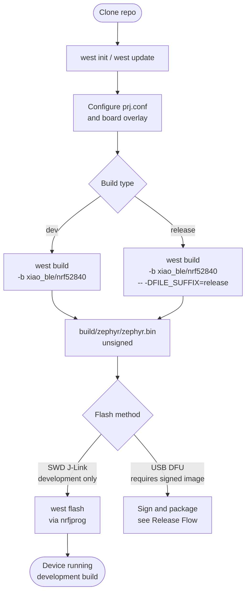
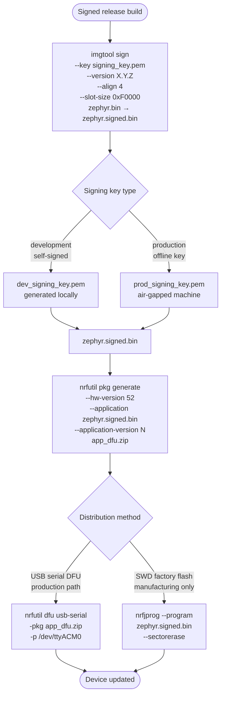
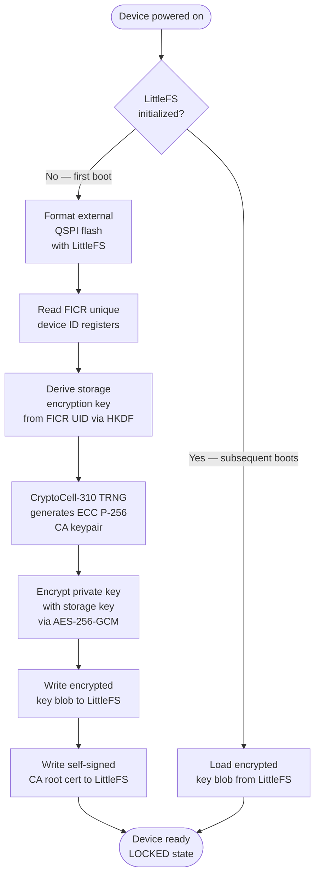
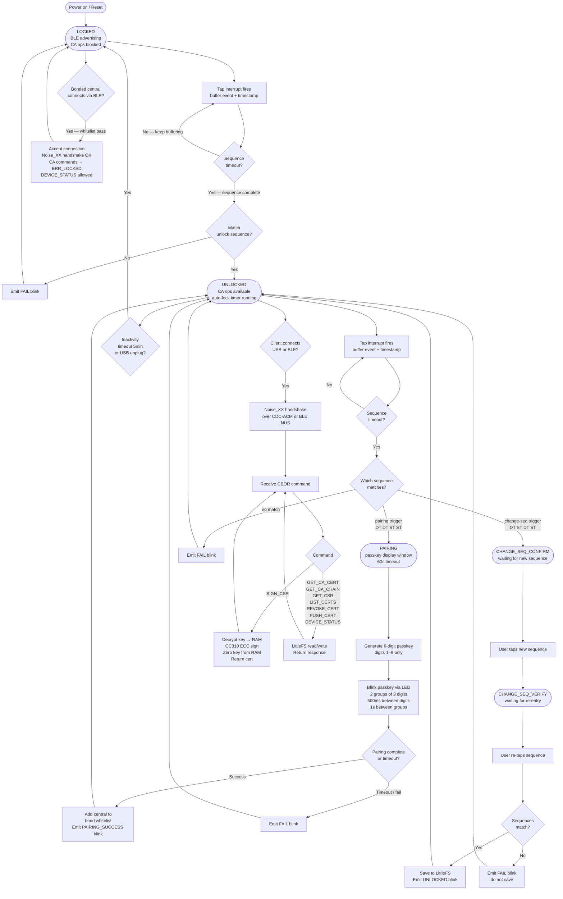
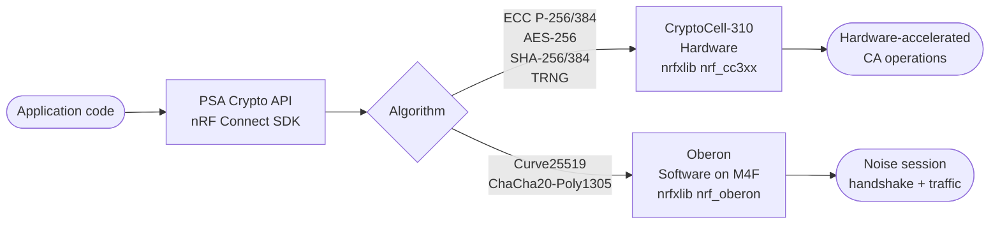
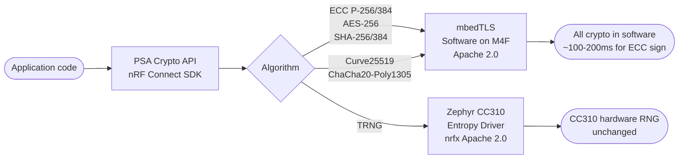

# Build and Release Process

## Prerequisites

- [nRF Connect SDK](https://developer.nordicsemi.com/nRF_Connect_SDK/doc/latest/nrf/getting_started.html) (includes Zephyr, west, arm-zephyr-eabi-gcc)
- `nrfutil` — DFU package generation and USB flashing
- `imgtool` — MCUboot image signing (bundled with nRF Connect SDK)
- `nrfjprog` — SWD/JTAG flashing for development (requires J-Link)
- `jq` — used by automation hooks

---

## Building the Host Client (cantil CLI)

The `cantil` CLI lives in `libcantil/` and is built with CMake against libsodium and mbedtls. Two build modes:

### Standard (dynamic) build

Built inside the `ubuntu2604` distrobox (where the libraries are installed):

```bash
distrobox enter ubuntu2604
cd libcantil
cmake -B build .
cmake --build build
# Binary: libcantil/build/cantil
```

The dynamic binary needs `libsodium.so.23` and `libmbedx509.so.7` at runtime — these exist inside the distrobox but not on the Fedora host.

### Static build (recommended for flatpak / host use)

Links libsodium and mbedtls as static archives. The resulting binary has no runtime dependencies beyond glibc, so it can run directly on the Fedora host via `flatpak-spawn --host`:

```bash
distrobox enter ubuntu2604
cd libcantil
cmake -B build_static -DCANTIL_CLI_STATIC=ON .
cmake --build build_static
# Binary: libcantil/build_static/cantil
```

### Device access from a flatpak sandbox

Claude Code runs inside a flatpak. USB CDC/ACM devices (`/dev/ttyACM*`) are only reachable via `flatpak-spawn --host`. Always prefix cantil commands with it:

```bash
flatpak-spawn --host libcantil/build_static/cantil status /dev/ttyACM0
flatpak-spawn --host libcantil/build_static/cantil pair /dev/ttyACM0
```

`scripts/provision_fw_signing_cert.sh` auto-detects the flatpak sandbox (checks `$FLATPAK_ID` / `/.flatpak-info`) and wraps cantil automatically.

### ttyACM1 echo workaround

The device enumerates two ACM nodes: `ttyACM0` (protocol) and `ttyACM1` (Zephyr shell/log). Linux defaults to `ECHO=true` on serial ports, so Zephyr console output on ttyACM1 is echoed back as input — this creates a tight shell feedback loop that starves the firmware main thread and can corrupt the Noise handshake.

Set ttyACM1 to raw mode immediately after the device enumerates:

```python
# flatpak-spawn --host python3 -c "..."
import termios, os
fd = os.open('/dev/ttyACM1', os.O_RDWR | os.O_NOCTTY | os.O_NONBLOCK)
tty = termios.tcgetattr(fd)
tty[0] &= ~(termios.IGNBRK | termios.BRKINT | termios.PARMRK | termios.ISTRIP |
             termios.INLCR | termios.IGNCR | termios.ICRNL | termios.IXON)
tty[1] &= ~termios.OPOST
tty[2] &= ~(termios.ECHO | termios.ECHONL | termios.ICANON | termios.ISIG |
             termios.IEXTEN | termios.CSIZE | termios.PARENB)
tty[2] |= termios.CS8
tty[3] &= ~(termios.ECHO | termios.ECHONL | termios.ICANON | termios.ISIG | termios.IEXTEN)
termios.tcsetattr(fd, termios.TCSANOW, tty)
os.close(fd)
```

A permanent fix via udev rule (`/tmp/99-cantil.rules`) is possible but not yet installed.

### Firmware signing cert provisioning

```bash
# After building build_static/cantil and pairing the device:
./scripts/provision_fw_signing_cert.sh [--port /dev/ttyACM0]
# Output: ~/.cantil/firmware-signing/{fw_signing.key.pem, fw_signing.cert.pem, ca.cert.pem}
```

The device must be **unlocked** (tap unlock sequence) before running. The script is idempotent — skips key generation if the key already exists.

---

## Development Build Flow



---

## Release Flow



---

## First Boot: Key Provisioning



---

## Full Device State Machine



---

## Crypto Backend Options

> **Stale — pending rewrite.** This section was written before the
> FREE-vs-ACCELERATED split in conversation_008 (2026-05-21) and before
> the PSA port across sessions 043–046. The current truth lives in
> CLAUDE.md § "Noise Crypto Backend Architecture" and § "CryptoCell-310
> Usage": (1) the FREE backend calls mbedtls *directly* (no PSA layer);
> (2) only the ACCELERATED backend routes through PSA; (3) the
> Curve25519 → Oberon routing diagrammed below is the **design intent**
> but does **not** currently fire — NCS PSA's dispatcher claims
> Montgomery 255 for CC3XX, which CC310 silicon does not implement, so
> Noise pair fails end-to-end on real hardware as of 2026-05-29 (session
> 046). See `project_psa_runtime_gate_findings.md` for the full trace.

The firmware has two crypto backend configurations. Both expose the same PSA
Crypto API — application `.c` files are identical. The choice affects only
`prj.conf` (and per-board `.conf` overlays) and has licensing and performance
implications.

### Comparison

| | nrfxlib (default) | mbedTLS (AGPLv3-clean) |
| --- | --- | --- |
| `prj.conf` | `CONFIG_NRF_SECURITY=y` + CC3XX + Oberon | `CONFIG_MBEDTLS=y` + `CONFIG_MBEDTLS_PSA_CRYPTO_C=y` |
| ECC P-256/384 signing | CC310 hardware ~1ms | mbedTLS software ~100–200ms |
| AES-256-GCM, SHA-256/384 | CC310 hardware | mbedTLS software (negligible difference) |
| Curve25519, ChaCha20-Poly1305 | Oberon software | mbedTLS software (both are software) |
| TRNG | CC310 hardware (Zephyr entropy driver) | CC310 hardware (same — unaffected) |
| Application code changes | — | none |
| License | Nordic proprietary (nrfxlib) | Apache 2.0 (mbedTLS) + Apache 2.0 (nrfx) |
| AGPLv3 firmware release | **No** — nrfxlib has no source | **Yes** |

### Why nrfxlib blocks AGPLv3

`CONFIG_NRF_SECURITY=y` causes the linker to include `libnrf_cc3xx` and
`libnrf_oberon` from Nordic's `nrfxlib` repository. These are pre-built static
libraries distributed with no source under a Nordic proprietary license.
AGPLv3 §6 requires complete corresponding source for all modules in the binary.
Since nrfxlib provides no source, that requirement cannot be satisfied.

### Switching to mbedTLS

In `prj.conf` (and any board-specific `.conf` files that duplicate these lines),
replace:

```kconfig
CONFIG_NRF_SECURITY=y
CONFIG_PSA_CRYPTO_DRIVER_CC3XX=y
CONFIG_PSA_CRYPTO_DRIVER_OBERON=y
```

with:

```kconfig
CONFIG_MBEDTLS=y
CONFIG_MBEDTLS_PSA_CRYPTO_C=y
```

No other files change.

### Crypto Backend Routing (PSA API)

**Default build — nrfxlib, hardware-accelerated:**



**AGPLv3-clean build — mbedTLS, fully open-source:**


