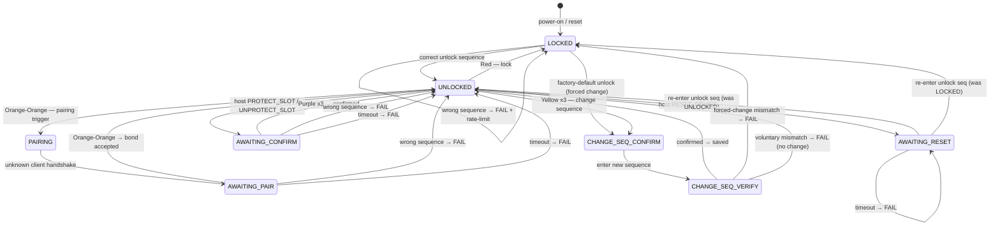
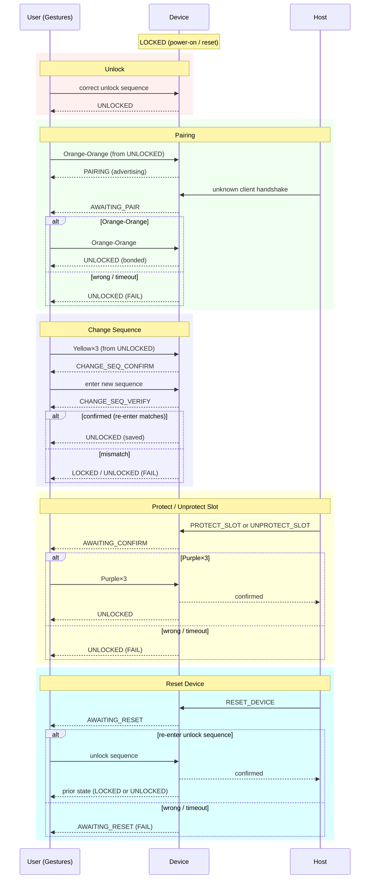

# Button UI — State Machine

Sequence names use the COUNT_COLOR alphabet (default). STDT_BINARY uses the same colour mapping; STDT_PLAIN substitutes ST/DT patterns.

## Interaction flows (sequence view)

## Sequence reference (COUNT_COLOR)

| Sequence | Gesture | Triggers |
| -------- | ------- | -------- |
| Red (×1) | 1 tap | Lock |
| Red×4 | 4 taps | Factory-default unlock |
| Orange-Orange | 2 taps, 2 taps | Pairing trigger (from UNLOCKED); pair-confirm (from AWAITING_PAIR) |
| Yellow×3 | 3 taps, 3 taps, 3 taps | Change-sequence trigger |
| Purple×3 | 6 taps, 6 taps, 6 taps → now **3 taps, 3 taps, 3 taps** | Confirm (PROTECT/UNPROTECT) |
| *(unlock seq)* | user-defined | RESET_DEVICE confirmation |

## Notes

- **PAIRING** is an idle advertising state entered via the pairing trigger; it advances to AWAITING_PAIR only when the session layer receives a handshake from an unknown client.
- **pre_state** in AWAITING_RESET means the device returns to whichever state (LOCKED or UNLOCKED) it was in before the reset prompt.
- The optional `GESTURE_REHEARSAL` build flag adds two extra sequences from UNLOCKED: Blue-Blue (simulates PROTECT_SLOT) and Cyan-Cyan (simulates RESET_DEVICE), bypassing the host command requirement.
- `SEQ_CONFIRM` (Purple×3) was reduced from `{6,6,6}` to `{3,3,3}` to ease the protect/unprotect UX.
