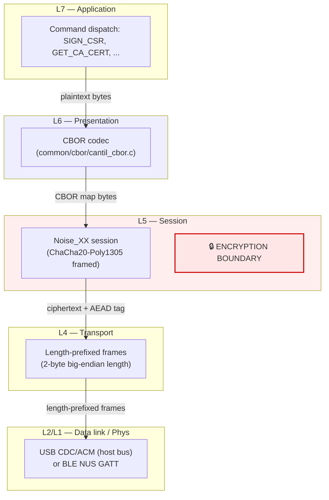
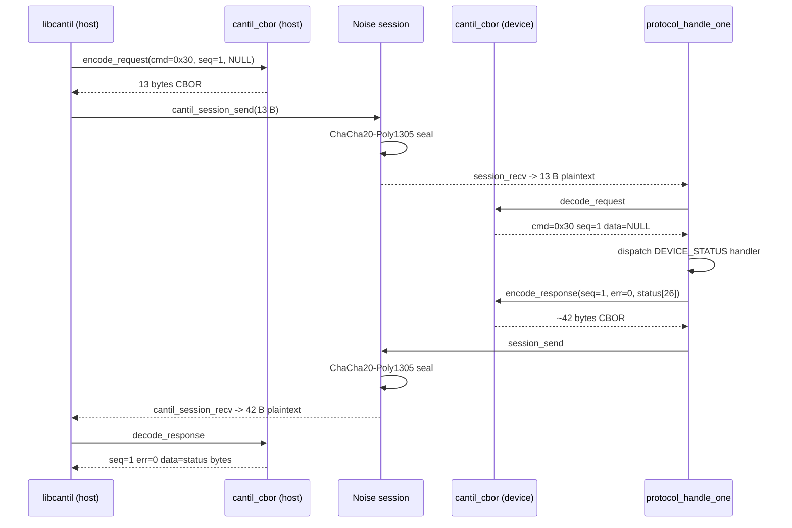

# Task 01 — CBOR Wire Protocol Foundation

**Status:** Landed 2026-05-28
**Touches:** [common/cbor/](../../common/cbor/), [firmware/src/protocol/protocol.c](../../firmware/src/protocol/protocol.c), [libcantil/src/device.c](../../libcantil/src/device.c)

---

## What this task adds

Replaces the placeholder "first byte = cmd, second byte = seq, rest = data"
wire encoding with a real, canonical CBOR ([RFC 8949](https://www.rfc-editor.org/rfc/rfc8949))
map shape that both the device and host client encode/decode through a single
shared module.

Schema:

```text
Request:   { "cmd": uint, "seq": uint, "data"?: bstr }
Response:  { "err": uint, "seq": uint, "data"?: bstr }
```

`"data"` is omitted entirely (map(2) instead of map(3)) when zero-length, so
status-only commands stay compact. Map keys are emitted in canonical (bytewise)
order; the decoder accepts any order to stay liberal in what it receives.

Why not zcbor or TinyCBOR?

- zcbor lives inside the NCS module tree and would force libcantil to either
  vendor it or pull NCS headers into a POSIX-host build — both unpleasant.
- TinyCBOR is fine but adds a submodule + ~3 KB of code for a schema that fits
  in 250 lines of hand-rolled C.
- A schema this narrow (two map shapes, three integer keys, one bstr key) is
  faster to audit as bespoke code than as a configuration of a general library.

The implementation is RFC-8949 valid CBOR on the wire — any third-party CBOR
library (Python `cbor2`, Go `fxamacker/cbor`, JS `cbor-x`) will round-trip it.

---

## Layered view (OSI / where encryption lives)



Confidentiality + integrity sit at the Noise session layer (L5). CBOR (L6) and
the command dispatcher (L7) operate on plaintext inside that envelope. The
USB or BLE link below (L2/L1) carries opaque ciphertext.

---

## Request / response round-trip



---

## Canonical encoding example

`DEVICE_STATUS` request (cmd = `0x30`, seq = `1`, no data):

```text
A2                              # map(2)
   63 63 6D 64                  #   tstr(3) "cmd"
   18 30                        #   uint(0x30)
   63 73 65 71                  #   tstr(3) "seq"
   01                           #   uint(1)
```

Successful response carrying the 26-byte status struct:

```text
A3                              # map(3)
   63 65 72 72                  #   tstr(3) "err"
   00                           #   uint(0)
   63 73 65 71                  #   tstr(3) "seq"
   01                           #   uint(1)
   64 64 61 74 61               #   tstr(4) "data"
   58 1A                        #   bstr(26) header
   <26 bytes packed struct>
```

Total response frame: 42 bytes plaintext (the Noise layer adds a 16-byte AEAD
tag and 2-byte length prefix).

---

## Code map

| File | Role |
| --- | --- |
| [common/cbor/cantil_cbor.h](../../common/cbor/cantil_cbor.h) | Public API: four encode/decode functions |
| [common/cbor/cantil_cbor.c](../../common/cbor/cantil_cbor.c) | RFC-8949 canonical CBOR encoder + permissive decoder |
| [firmware/src/protocol/protocol.c](../../firmware/src/protocol/protocol.c) | Device dispatcher: replaced `stub_read_*` / `stub_encode_response` with the codec |
| [libcantil/src/device.c](../../libcantil/src/device.c) | Host client: new `do_request()` helper wraps every command |
| [firmware/tests/protocol_cbor/](../../firmware/tests/protocol_cbor/) | 13-test ztest on `native_sim` |

---

## Test plan (all PASS)

| Test | Verifies |
| --- | --- |
| `test_encode_request_canonical_status` | Golden bytes for `DEVICE_STATUS` request |
| `test_encode_response_canonical_with_data` | Golden bytes for a response with 4-byte bstr |
| `test_roundtrip_request_no_data` | map(2) encode → decode identity |
| `test_roundtrip_request_with_data` | map(3) with 37-byte data |
| `test_roundtrip_response` | response with 26-byte status struct |
| `test_decode_request_reorders_seq_first` | Liberal decode accepts non-canonical key order |
| `test_decode_skips_unknown_key` | Forward-compat: unknown map entries ignored |
| `test_decode_rejects_short_buffer` | Truncated input → `-EINVAL` |
| `test_decode_rejects_wrong_top_type` | Array at top → `-EINVAL` |
| `test_decode_rejects_missing_required_key` | Missing `seq` → `-ENOENT` |
| `test_decode_rejects_truncated_bstr` | bstr length exceeds buffer → `-EINVAL` |
| `test_encode_returns_enomem_on_small_buffer` | Buffer too small → `-ENOMEM` |
| `test_roundtrip_large_bstr` | 3000-byte bstr round-trip (cert-sized) |

---

## Session log

User asked: "What CA functions still need to be defined and implemented?
Arrange each as a separate task. Document the whole process in firmware code
and through CBOR. Include mermaid charts. Then implement, write unit tests,
update docs, and commit. One at a time."

After surveying ca.c / protocol.c I identified 14 tasks. User confirmed:
pause after Task 1 (this one), then run tasks 2–14 autonomously with
per-task conversation logs, ztest with mocks, libcantil updated each task,
docs under docs/ca/.

This task swaps every wire-format byte the protocol emits or consumes. After
this lands, every subsequent task (SIGN_CSR, LIST_CERTS, …) speaks real CBOR
to the client without any custom framing inside individual handlers.
