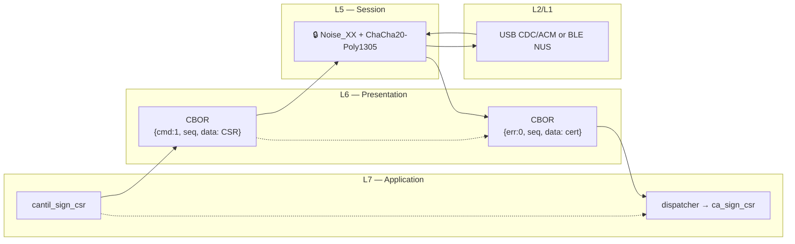
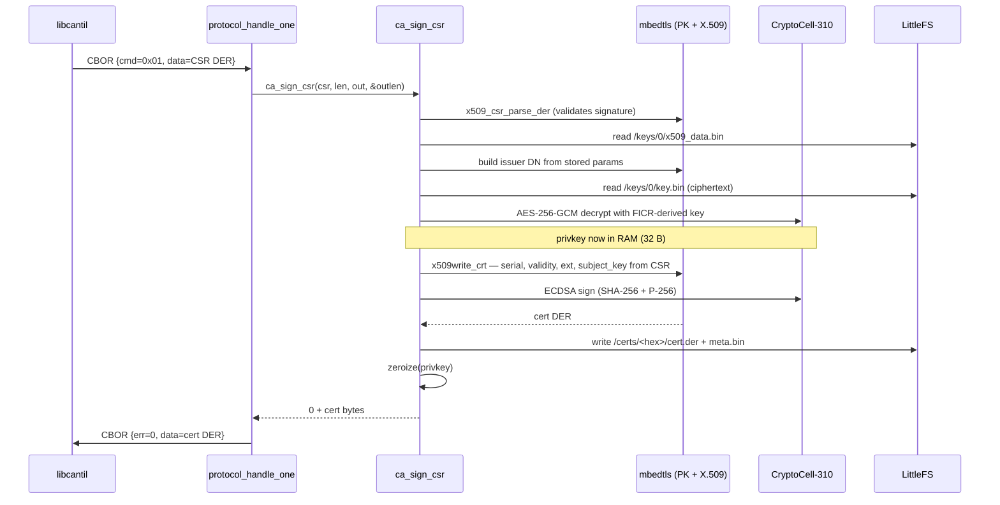

# Task 02 — SIGN_CSR (slot 0)

**Status:** Landed 2026-05-28
**Opcode:** `CMD_SIGN_CSR` (0x01)
**Touches:** [firmware/src/ca/ca.c](../../firmware/src/ca/ca.c), [firmware/src/storage/storage.{h,c}](../../firmware/src/storage/), [firmware/include/cantil_mbedtls_user_config.h](../../firmware/include/cantil_mbedtls_user_config.h), [libcantil/src/ca.c](../../libcantil/src/ca.c)

---

## What this task adds

The headline CA function — accept a PKCS #10 CSR from the client, validate it,
sign it with slot 0's CA key (loaded from encrypted LittleFS, used in
CryptoCell-310, zeroed from RAM), and store the resulting X.509 v3 end-entity
certificate in the issued-cert store.

**Request:** raw PKCS #10 CSR DER.
**Response:** raw X.509 certificate DER.

Defaults the new cert gets (no client knobs yet):
- Validity: `2026-01-01` → `+365 days`. No RTC; same fixed not-before baseline as the bootstrap cert.
- Basic Constraints: `cA: FALSE` — end-entity cert.
- Key Usage: `digitalSignature`.
- Signature: ECDSA-with-SHA256.
- Serial: 8 TRNG bytes, high bit cleared and low bit set so the ASN.1 INTEGER is positive and non-zero (no leading-`0x00` ambiguity).

---

## Wire / OSI view



The CSR never leaves the Noise envelope; the private CA key never leaves the
device.

---

## Sequence



---

## Failure modes

| Condition | Return | Wire err |
| --- | --- | --- |
| CA not ready (no slot 0 cert) | `-ENOENT` | `ERR_CRYPTO` |
| `csr_der == NULL` or `csr_len == 0` | `-EINVAL` | `ERR_CRYPTO` |
| Malformed CSR (parse fails) | `-EINVAL` | `ERR_CRYPTO` |
| Output buffer too small | `-ENOMEM` | `ERR_CRYPTO` |
| Crypto / storage failure | `-EIO` / errno | `ERR_CRYPTO` |

(The dispatcher currently squashes all CA errors to `ERR_CRYPTO`; finer-grained
mapping is a later cleanup task.)

---

## Storage layout introduced

```text
/certs/
  <hex-serial>/
    cert.der          ← X.509 v3 certificate (DER)
    meta.bin          ← issued_cert_meta_t (108 B, packed v1)
```

`issued_cert_meta_t` layout (`ca.c`):

```c
struct {
    uint8_t  version;          // 1
    uint8_t  flags;            // bit0=revoked, bit1=protected, bit2=expired
    uint8_t  serial_len;       // 1..20
    uint8_t  reserved0;
    uint32_t issuer_slot;
    uint64_t not_before_unix;  // 0 if unknown
    uint64_t not_after_unix;   // 0 if unknown
    uint8_t  serial[20];
    char     cn[64];           // null-terminated
};
```

Tasks 4 (LIST_CERTS), 5 (REVOKE_CERT), 6 (AUTO_EXPIRE) all read this struct.

---

## Code map

| File | Role |
| --- | --- |
| [firmware/src/ca/ca.c](../../firmware/src/ca/ca.c) | `ca_sign_csr` implementation + `issued_cert_meta_t` + `load_ca_x509_params` helper |
| [firmware/src/storage/storage.{h,c}](../../firmware/src/storage/) | `storage_issued_meta_write/read`, `storage_issued_cert_exists`, internal `hex_path()` helper |
| [firmware/include/cantil_mbedtls_user_config.h](../../firmware/include/cantil_mbedtls_user_config.h) | Force `MBEDTLS_X509_CSR_PARSE_C` on (otherwise gated on TLS in Zephyr's generic config) |
| [firmware/src/protocol/protocol.c](../../firmware/src/protocol/protocol.c) | (unchanged — dispatcher already routed `CMD_SIGN_CSR` to `ca_sign_csr`) |
| [libcantil/src/ca.c](../../libcantil/src/ca.c) | `cantil_sign_csr` + `cantil_get_ca_cert` host-side wrappers |
| [libcantil/src/internal.h](../../libcantil/src/internal.h) | Full CMD_* table + `cantil_do_request` exposed for cross-module use |
| [firmware/tests/sign_csr/](../../firmware/tests/sign_csr/) | 6-test ztest suite on `native_sim` |

---

## Test plan (all PASS)

| Test | Verifies |
| --- | --- |
| `test_01_sign_before_ready_returns_enoent` | Refuses to sign before slot 0 is provisioned |
| `test_02_roundtrip_parse_issuer_subject_serial` | Issued cert parses as v3, 8-byte serial, subject matches CSR, issuer matches CA |
| `test_03_signature_verifies_against_ca_pubkey` | `mbedtls_x509_crt_verify(child, ca, ...)` returns 0 |
| `test_04_issued_store_has_cert_and_meta` | `/certs/<hex>/cert.der` and `meta.bin` both written; meta has correct version/flags/serial/issuer_slot |
| `test_05_empty_csr_rejected` | NULL/0 and 16-byte junk both → `-EINVAL` |
| `test_06_two_signs_have_distinct_serials` | Two signs produce distinct serials and `count_issued_certs` reports 2 |

ca_bootstrap suite still PASS 6/6 — no regression from the serial-mask fix.

---

## Session log

The first ztest run failed two cases (`test_02` serial length, `test_06`
distinct serials). Root cause: the existing "ensure positive serial" mask
in both `ca_sign_csr` and the bootstrap self-signed builder was wrong —
`serial[0] |= 0x01` only sets the low bit but leaves the high bit
untouched. mbedtls treats the byte string as a big-endian ASN.1 INTEGER:
if the high bit is set, it prepends a `0x00` byte to keep the value
non-negative, which then shows up as a 9-byte serial when parsed back.

Fix: `serial[0] = (serial[0] & 0x7F) | 0x01` — clear the sign bit AND
guarantee non-zero. Applied to both the bootstrap and SIGN_CSR sites.

After the fix all 6 SIGN_CSR tests + all 6 ca_bootstrap tests pass.
