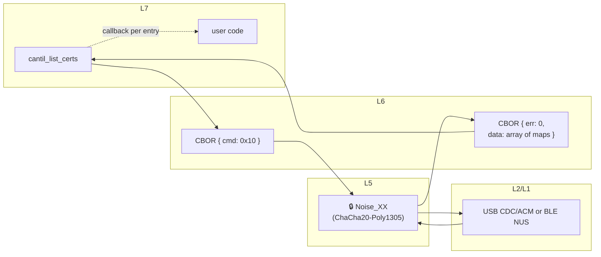
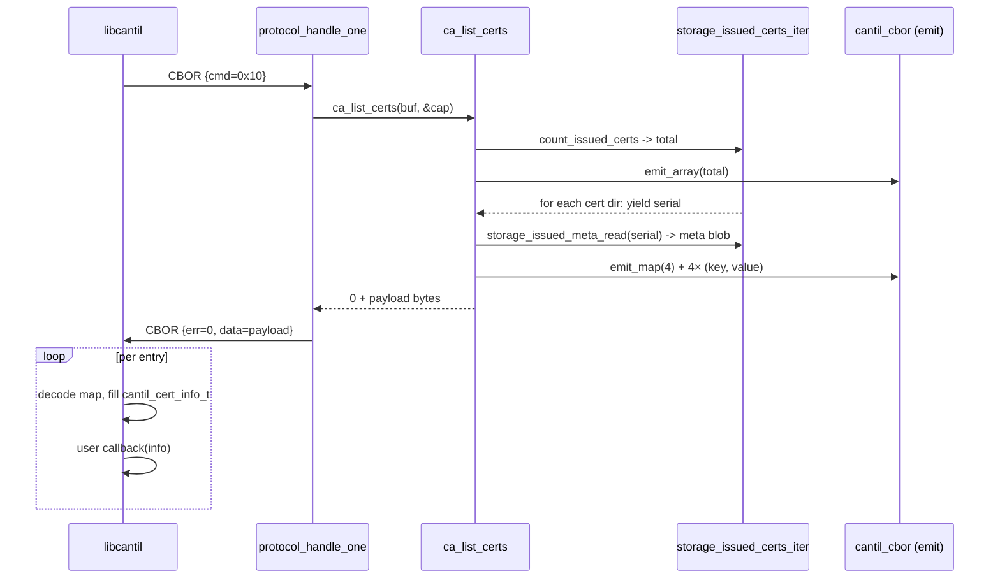

# Task 04 — LIST_CERTS + GET_CERT_COUNT

**Status:** Landed 2026-05-28
**Opcodes:** `CMD_LIST_CERTS` (0x10), `CMD_GET_CERT_COUNT` (0x12)
**Touches:** [common/cbor/cantil_cbor.{h,c}](../../common/cbor/), [firmware/src/storage/storage.{h,c}](../../firmware/src/storage/), [firmware/src/ca/ca.c](../../firmware/src/ca/ca.c), [libcantil/src/ca.c](../../libcantil/src/ca.c)

---

## What this task adds

`GET_CERT_COUNT` — single uint32 count of issued certs. Thin wrapper around
`storage_count_issued_certs`.

`LIST_CERTS` — CBOR array of small maps, one per issued cert. Lets a client
enumerate the cert store without having to download every DER blob.

**Payload schema (canonical CBOR):**

```text
[
  { "f": <flags uint>,        # bit0=revoked, bit1=protected, bit2=expired
    "i": <issuer_slot uint>,
    "n": "subject CN string",
    "s": <serial bstr> },
  ...
]
```

One-char keys keep the payload compact (each entry ~25–40 B for an 8-byte
serial and ~10-char CN). With the current ~4 KB response budget, ~100
entries fit comfortably; larger stores would need a paging command (not
in scope here).

Canonical key order: `f` (0x66) `<` `i` (0x69) `<` `n` (0x6E) `<` `s` (0x73).

---

## Wire / OSI view



Payload is *CBOR-inside-CBOR* — the outer response frame wraps an inner
array. Both layers go through the same `cantil_cbor.c` primitives.

---

## Sequence



---

## CBOR primitives exposed for handler use

Previously `cantil_cbor.c` only offered the high-level
`encode_request`/`encode_response`/`decode_*` API. Task 4 needed array+map
construction inside the response payload, so the low-level helpers are now
public:

```c
int cantil_cbor_emit_head(buf, max, *off, major, val);
int cantil_cbor_emit_uint/bstr/tstr/array/map(...);
int cantil_cbor_read_head/uint32/bstr/tstr(...);
```

Major-type constants (`CANTIL_CBOR_MT_UINT`, `_BSTR`, `_TSTR`, `_ARRAY`,
`_MAP`) are exported too. `skip_item()` internally now handles arrays as
well so unknown CBOR shapes in future map decodes won't crash.

---

## Storage iterator helper

`storage_issued_certs_iter(cb, user)` — walks `/certs/` once, decodes each
subdirectory name back into a serial byte array (rejects non-hex / non-even
/ over-20-byte names), and invokes `cb(serial, len, user)`. `cb` can
return non-zero to stop iteration early.

---

## Failure modes

| Condition | `ca_list_certs` | Wire err |
| --- | --- | --- |
| `buf == NULL`, `len == NULL`, `*len < 16` | `-EINVAL` | `ERR_STORAGE` |
| Output buffer fills before all entries emitted | `-ENOMEM` (full output discarded) | `ERR_STORAGE` |
| Storage read error | `-errno` | `ERR_STORAGE` |

Note: the all-or-nothing semantics on overflow are intentional — partial
output would produce a malformed array (header count > entries).

---

## Code map

| File | Role |
| --- | --- |
| [common/cbor/cantil_cbor.h](../../common/cbor/cantil_cbor.h) | New low-level emit/read primitives + `CANTIL_CBOR_MT_*` constants |
| [common/cbor/cantil_cbor.c](../../common/cbor/cantil_cbor.c) | Public primitive wrappers; `MT_ARRAY` added to `skip_item` |
| [firmware/src/storage/storage.{h,c}](../../firmware/src/storage/) | `storage_issued_certs_iter` + `hex_nibble` helper |
| [firmware/src/ca/ca.c](../../firmware/src/ca/ca.c) | `ca_list_certs` (two-pass count + emit) + `ca_get_cert_count` |
| [libcantil/src/ca.c](../../libcantil/src/ca.c) | `cantil_list_certs` (CBOR decoder + per-entry user callback), `cantil_get_cert_count` |
| [firmware/tests/sign_csr/](../../firmware/tests/sign_csr/) | tests 10/11/12 |

---

## Tests (sign_csr suite — now 12/12 PASS)

- `test_10_list_certs_empty` — bootstrap with no signs → array(0).
- `test_11_list_certs_after_two_signs` — two CSR signs → array(2), first
  serial is 8 bytes, count from `ca_get_cert_count` matches.
- `test_12_list_certs_tiny_buffer_errors` — 16-byte output buffer with one
  cert outstanding → `-ENOMEM`, `*len == 0`.

protocol_cbor regression suite still 13/13 PASS after the codec extension.

## Session log

The CBOR-array overflow recovery path got over-engineered on the first
draft (rewinding, re-encoding the array header with the smaller count).
Simplified to "all or nothing": if overflow happens, return `-ENOMEM` and
let the caller bump its buffer. Cleaner contract, and the only realistic
overflow case is the LIST_CERTS payload — currently capped at the response
frame budget (~4 KB), which fits ~100 entries.

`strnlen` wasn't declared in the test build (POSIX feature gating). Used
an inline bounded `while` loop instead — no extra header juggling.

Build size: not measured for this task (firmware build before commit had
the same 207424 B FLASH as Task 02; new code is small).
