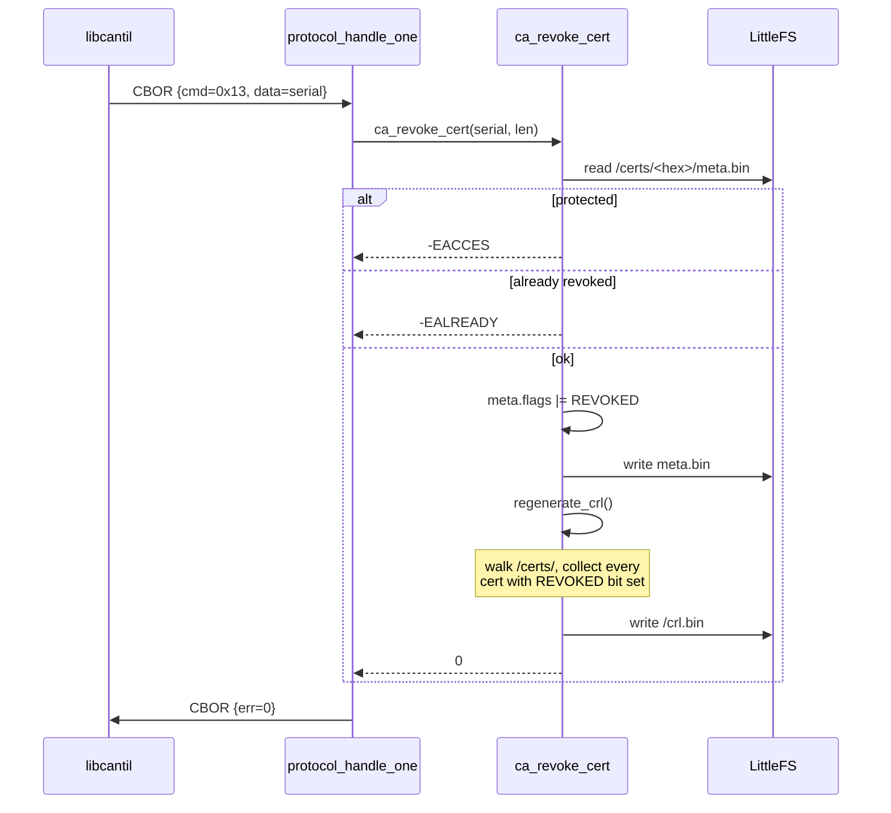

# Task 05 — REVOKE_CERT + CRL regeneration

**Status:** Landed 2026-05-28
**Opcodes:** `CMD_REVOKE_CERT` (0x13), `CMD_GET_CRL` (0x15 — already wired)
**Touches:** [firmware/src/ca/ca.c](../../firmware/src/ca/ca.c), [libcantil/src/ca.c](../../libcantil/src/ca.c)

---

## What this task adds

`REVOKE_CERT` — mark an issued certificate as revoked and regenerate the CRL.

**Request:** raw serial bstr.
**Response:** none (success = `err=0`).

Refuses to revoke certs with `ISSUED_FLAG_PROTECTED` set
(`PROTECT_SLOT` with `protect_issued_certs=true` propagates this flag to
already-issued certs — Task 10 plumbing).

---

## Sequence



---

## CRL wire format (internal, v1)

The full RFC 5280 DER CRL writer doesn't ship with NCS's mbedtls config
(and `MBEDTLS_X509_CRL_WRITE_C` doesn't exist — DER CRL emission would
need a hand-rolled ASN.1 builder). For this iteration the CRL is a flat
packed blob at `/lfs/crl.bin`, returned verbatim by `GET_CRL`:

```text
offset  size  field
   0      1   version = 1
   1      4   count (big-endian uint32)
   5     ..   entries:
              repeated (serial_len(1), serial[serial_len])
```

Capped at `CRL_MAX_BYTES = 1 + 4 + (1 + 20) × 64 = 1349 B` — 64 revoked
serials, plenty for any single CA's expected lifetime on this device.
Overflow logs a warning and truncates; the file remains internally
consistent.

**TODO** upgrade to a signed RFC 5280 DER CRL once
a CRL writer is in scope. Clients that need to feed this into a stock
X.509 toolchain should treat the current blob as device-internal.

---

## Failure modes

| Condition | `ca_revoke_cert` | Wire err |
| --- | --- | --- |
| `serial == NULL` or `serial_len == 0 / > 20` | `-EINVAL` | `ERR_STORAGE` |
| No such cert | `-ENOENT` | `ERR_STORAGE` |
| Corrupt meta (version mismatch) | `-EINVAL` | `ERR_STORAGE` |
| Cert protected | `-EACCES` | `ERR_STORAGE` |
| Already revoked | `-EALREADY` | `ERR_STORAGE` |
| Meta or CRL write fails | `-errno` | `ERR_STORAGE` |

---

## Code map

| File | Role |
| --- | --- |
| [firmware/src/ca/ca.c](../../firmware/src/ca/ca.c) | `ca_revoke_cert`, `regenerate_crl`, `crl_collect_cb` |
| [firmware/src/storage/storage.c](../../firmware/src/storage/storage.c) | `storage_crl_write/read` (already existed) |
| [libcantil/src/ca.c](../../libcantil/src/ca.c) | `cantil_revoke_cert`, `cantil_get_crl` |

`ca_list_certs` already surfaces `flags` in its CBOR-array payload (Task 4),
so a revoked cert's `f` field changes from 0x00 → 0x01 after a successful
revoke — clients can spot it without re-issuing `GET_CRL`.

---

## Tests (sign_csr — now 16/16 PASS)

- `test_13_revoke_unknown_serial` → `-ENOENT`.
- `test_14_revoke_flips_meta_flag` → bit0 set; double revoke `-EALREADY`.
- `test_15_revoke_protected_cert_blocked` → manually set protected bit, revoke returns `-EACCES`.
- `test_16_crl_contains_revoked_serial` → after revoke, `/crl.bin` has v1 header, count=1, and the cert's serial bytes.

## Session log

The big design choice was CRL format. mbedtls in Zephyr ships parsers
(`X509_CRL_PARSE_C` if enabled), but no writer. Writing a DER CRL by hand
is ~150 lines of ASN.1 plumbing — not justified for this iteration when
the protocol's `GET_CRL` consumer is internal. Chose the flat blob and
documented the TODO loudly so a future task picks it up without
re-discovery.

Firmware grew by ~5 KB (FLASH 212080 B / 972 KB, 21.31%).
