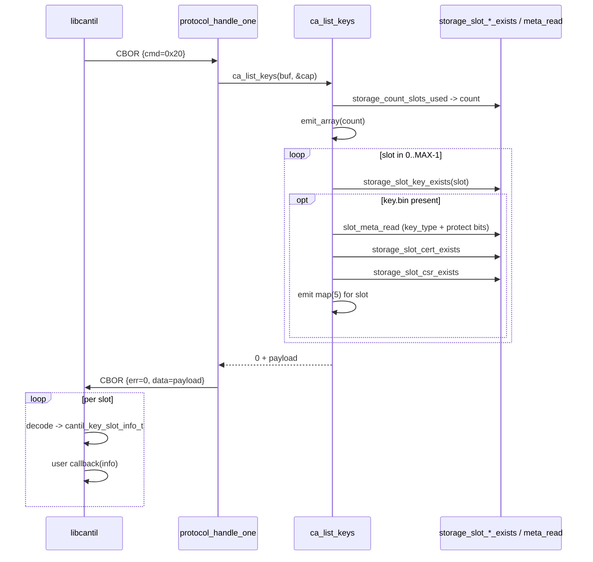

# Task 07 — LIST_KEYS

**Status:** Landed 2026-05-28
**Opcode:** `CMD_LIST_KEYS` (0x20)
**Touches:** [firmware/src/storage/storage.{h,c}](../../firmware/src/storage/), [firmware/src/ca/ca.c](../../firmware/src/ca/ca.c), [libcantil/src/ca.c](../../libcantil/src/ca.c)

---

## What this task adds

`LIST_KEYS` — enumerate every populated key slot (0..`CANTIL_MAX_KEY_SLOTS-1`)
with at-a-glance state: key type, protection bits, whether a cert and/or
CSR is present.

**Request:** none.
**Response payload:** canonical CBOR array of `map(5)`.

```text
[
  { "c": <has_cert uint>,        # 0 / 1
    "p": <protect_bits uint>,    # bit0=is_protected, bit1=protect_issued
    "r": <has_csr uint>,         # 0 / 1
    "s": <slot_id uint>,
    "t": <key_type uint> },      # 1 = P-256
  ...
]
```

Canonical key order (bytewise on tstr keys): `c` (0x63) < `p` (0x70) <
`r` (0x72) < `s` (0x73) < `t` (0x74).

---

## Sequence



---

## Storage extensions

| Helper | Purpose |
| --- | --- |
| `storage_slot_key_exists(slot)` | does `/keys/<slot>/key.bin` exist? |
| `storage_slot_csr_exists(slot)` | does `/keys/<slot>/csr.der` exist? |

Mirrors the existing `storage_slot_cert_exists(slot)` helper.

---

## Failure modes

| Condition | `ca_list_keys` | Wire err |
| --- | --- | --- |
| `cbor_out == NULL` / `*len < 16` | `-EINVAL` | `ERR_STORAGE` |
| Output buffer overflow | `-ENOMEM` (all-or-nothing) | `ERR_STORAGE` |
| Race between pass-1 count and pass-2 walk | `-EIO` | `ERR_STORAGE` |
| Storage read error | `-errno` | `ERR_STORAGE` |

---

## Code map

| File | Role |
| --- | --- |
| [firmware/src/storage/storage.{h,c}](../../firmware/src/storage/) | `storage_slot_key_exists`, `storage_slot_csr_exists` |
| [firmware/src/ca/ca.c](../../firmware/src/ca/ca.c) | `ca_list_keys` (two-pass count + emit) |
| [libcantil/src/ca.c](../../libcantil/src/ca.c) | `cantil_list_keys` — CBOR decode + per-slot user callback |

`cantil_key_slot_info_t.pub_key`, `created_at`, and cert-derived fields
(`cert_serial`, `cert_subject`, `cert_not_before/after`) aren't yet
populated — those need either separate `GET_KEY_PUBKEY` opcodes or per-
slot cert parsing inside the response, both out of scope for this task.
Forward-compatible: the wire schema is unaffected when those fields move
on-wire.

---

## Tests (sign_csr — 22/22 PASS)

- `test_21_list_keys_empty` — pre-bootstrap → array(0).
- `test_22_list_keys_after_bootstrap_slot_zero` — bootstrap slot 0 →
  array(1), slot=0, key_type=1 (P-256), `c=1` (cert present), `p` bit0
  set (slot 0 is always protected at bootstrap).

protocol_cbor + ca_bootstrap regressions still pass.

## Session log

Reused the LIST_CERTS payload pattern from Task 4 — same two-pass count-
then-emit, same `-ENOMEM` all-or-nothing overflow contract. Decoder
helper in the test file is a near-clone of `decode_list_certs`; could be
factored into a shared test util later but it's only ~30 lines.

Build: FLASH 212912 B / 972 KB (21.39%, +576 B).
