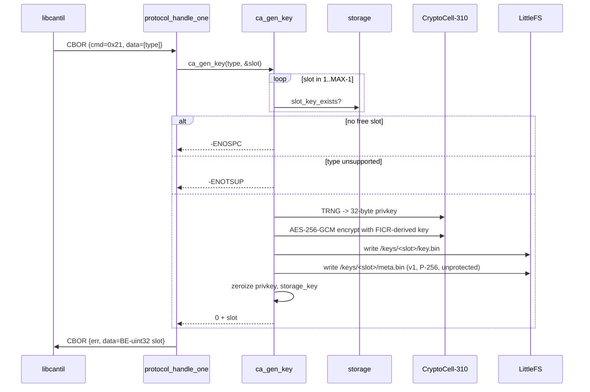

# Task 08 — GEN_KEY

**Status:** Landed 2026-05-28
**Opcode:** `CMD_GEN_KEY` (0x21)
**Touches:** [firmware/src/ca/ca.c](../../firmware/src/ca/ca.c), [firmware/src/protocol/protocol.c](../../firmware/src/protocol/protocol.c), [libcantil/src/ca.c](../../libcantil/src/ca.c)

---

## What this task adds

Allocate the next free general-purpose key slot (1..`MAX-1`; slot 0 is
the reserved master CA), generate a P-256 keypair on the TRNG, encrypt
with the FICR-derived storage key, persist `key.bin` + `meta.bin`. Return
the assigned slot ID.

**Request:** 1-byte key_type (1 = P-256; 0 treated as P-256 default).
**Response:** 4-byte BE uint32 slot_id.

---

## Sequence

---

## Failure modes

| Condition | `ca_gen_key` | Wire err |
| --- | --- | --- |
| `slot_id_out == NULL` | `-EINVAL` | `ERR_INVALID_ARGS` |
| Unknown `key_type` (only P-256 supported) | `-ENOTSUP` | `ERR_INVALID_ARGS` |
| All slots 1..MAX-1 used | `-ENOSPC` | `ERR_NO_SLOTS` |
| TRNG / storage failure | `-errno` | `ERR_CRYPTO` |

Dispatcher maps `ca_gen_key` errnos to wire errors finer-grained than the
previous "any error → ERR_NO_SLOTS" — clients can distinguish "wrong
type" from "out of room".

---

## Code map

| File | Role |
| --- | --- |
| [firmware/src/ca/ca.c](../../firmware/src/ca/ca.c) | `ca_gen_key` — slot scan + provisioning flow that mirrors `ca_provision` for slot 0 |
| [firmware/src/protocol/protocol.c](../../firmware/src/protocol/protocol.c) | `CMD_GEN_KEY` case maps `-ENOSPC` / `-ENOTSUP` / `-EINVAL` to distinct wire errors |
| [libcantil/src/ca.c](../../libcantil/src/ca.c) | `cantil_gen_key` |

---

## Tests (sign_csr — 25/25 PASS)

- `test_23_gen_key_allocates_slot_one` — first call (slot 1 empty) returns slot=1, `key.bin` present.
- `test_24_gen_key_unsupported_type` — key_type=99 → `-ENOTSUP`, `slot` zeroed.
- `test_25_gen_key_picks_next_free` — three consecutive calls return slots 1, 2, 3.

## Session log

Straightforward — `ca_provision` was already a working template for the
encrypted-blob + meta-write flow; `ca_gen_key` is structurally the same,
just with slot scanning up front and `is_protected=0` by default
(non-CA slots aren't protected unless the user explicitly PROTECTs them
later via Task 10).

Tightened the dispatcher error mapping while I was in there.

Build: FLASH 213384 B / 972 KB (21.44%, +472 B).
