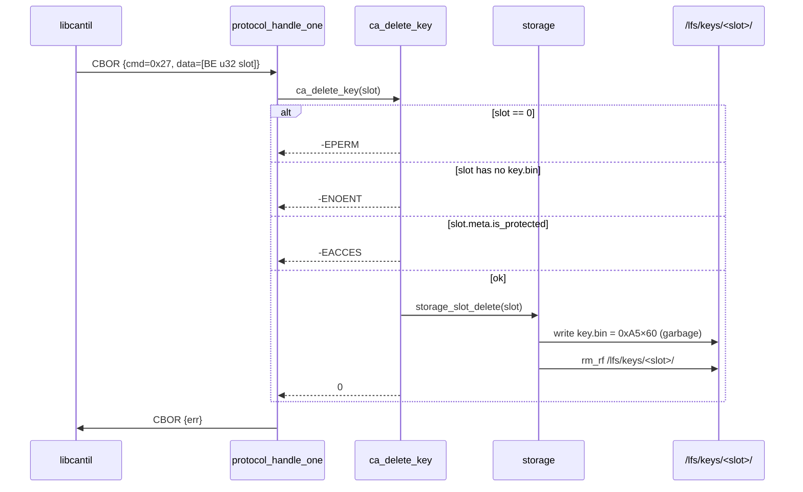

# Task 09 — DELETE_KEY (new opcode)

**Status:** Landed 2026-05-28
**Opcode:** `CMD_DELETE_KEY` (**new** — 0x27)
**Touches:** [firmware/src/protocol/protocol.{h,c}](../../firmware/src/protocol/), [firmware/src/ca/ca.{h,c}](../../firmware/src/ca/), [firmware/src/storage/storage.{h,c}](../../firmware/src/storage/), [libcantil/](../../libcantil/)

---

## What this task adds

The first **new opcode** added to the wire protocol since the spec was
drafted. `DELETE_KEY` wipes an entire key slot — key blob, meta, x509
data, cert, CSR, CRL — overwriting `key.bin` with random garbage before
unlinking so the encrypted plaintext is unrecoverable (FICR-derived
storage key is intrinsic to the SoC, so erasing the ciphertext destroys
the key).

**Request:** 4-byte BE uint32 slot_id.
**Response:** none (success = `err=0`).

Refused for:
- slot 0 — the master CA cannot be deleted (`-EPERM`)
- protected slots — must `UNPROTECT_SLOT` first (`-EACCES`)
- unpopulated slots — `-ENOENT`

---

## Sequence

---

## Why overwrite the key blob before unlink

LittleFS-level `fs_unlink` only marks the metadata gone; the encrypted
blob bytes remain on flash until the wear-leveller eventually overwrites
them. Writing 0xA5 over `key.bin` first forces a page-erase + reprogram
under the wear-levelling layer, destroying the ciphertext. Same logic
as `storage_secure_wipe`.

---

## Failure modes & wire mapping

| Condition | `ca_delete_key` | Wire err |
| --- | --- | --- |
| `slot_id == 0` (master CA) | `-EPERM` | `ERR_DEVICE_LOCKED` |
| `slot_id >= MAX_KEY_SLOTS` | `-EINVAL` | `ERR_INVALID_ARGS` |
| `key.bin` not present | `-ENOENT` | `ERR_NOT_FOUND` |
| `meta.is_protected == 1` | `-EACCES` | `ERR_DEVICE_LOCKED` |
| Request bstr < 4 B | (dispatcher) | `ERR_INVALID_ARGS` |
| Storage error during wipe | `-errno` | `ERR_STORAGE` |

`-EPERM` and `-EACCES` both surface as `ERR_DEVICE_LOCKED` on the wire —
existing error-code set has no "permission denied" entry; introducing one
is a separate concern.

---

## Code map

| File | Role |
| --- | --- |
| [firmware/src/protocol/protocol.h](../../firmware/src/protocol/protocol.h) | New `CMD_DELETE_KEY = 0x27` in the enum |
| [firmware/src/protocol/protocol.c](../../firmware/src/protocol/protocol.c) | Dispatcher case: decode 4 B BE slot, call, map errnos |
| [firmware/src/ca/ca.{h,c}](../../firmware/src/ca/) | `ca_delete_key` — guards slot 0, protected, missing slot; calls storage helper |
| [firmware/src/storage/storage.{h,c}](../../firmware/src/storage/) | `storage_slot_delete(slot)` — garbage-overwrite then `rm_rf` |
| [libcantil/include/cantil.h](../../libcantil/include/cantil.h) | New declaration `cantil_delete_key(s, slot_id)` |
| [libcantil/src/ca.c](../../libcantil/src/ca.c) | Client impl: BE u32 request, empty response |

---

## Tests (sign_csr — 29/29 PASS)

- `test_26_delete_slot_zero_refused` → `-EPERM`, slot 0 still present.
- `test_27_delete_unknown_slot` → `-ENOENT`.
- `test_28_delete_protected_blocked` — gen slot, set `is_protected`, delete → `-EACCES`, slot still present.
- `test_29_delete_unprotected_succeeds` — gen slot, delete, `key.bin` gone.

Also expanded `test_before` to wipe slots 0–7 instead of just 0–1 —
earlier tests (`test_25_gen_key_picks_next_free`) populate slots 2/3,
which leaked into Task-9 tests checking unknown slots.

## Session log

First add of a new opcode (0x27) since the spec. Followed the existing
0x21 / 0x26 dispatcher pattern: decode the slot ID as BE u32 from the
request bstr, call `ca_delete_key`, map errnos.

First test run flagged three failures that were all the same root cause:
test isolation — earlier tests leave slots 2/3 populated, so a later
"delete unknown slot 2" test gets `0` instead of `-ENOENT`. Expanded
`test_before` to wipe slots 0..7. Fix worked on the next run.

Build: FLASH 213916 B / 972 KB (21.49%, +532 B).
