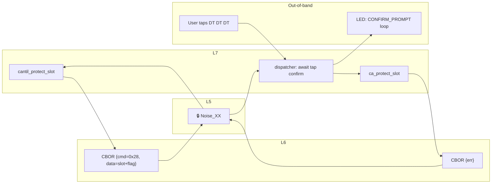

# Task 10 — PROTECT_SLOT + UNPROTECT_SLOT (new opcodes)

**Status:** Landed 2026-05-28
**Opcodes:** `CMD_PROTECT_SLOT` (**new** — 0x28), `CMD_UNPROTECT_SLOT` (**new** — 0x29)
**Touches:** [firmware/src/protocol/](../../firmware/src/protocol/), [firmware/src/ca/ca.{h,c}](../../firmware/src/ca/), [libcantil/](../../libcantil/)

---

## What this task adds

Two new opcodes that flip the protection flag on a key slot. Both require
the user to perform the **confirm tap gesture** on the device within the
10-second `CONFIG_CANTIL_CONFIRM_TIMEOUT_SEC` window (3× double-tap by
default — see CLAUDE.md gesture spec). The dispatcher blocks until the
gesture machine reports `CANTIL_CONFIRM_OK`, then applies the change.

### PROTECT_SLOT semantics

- Sets `slot_meta.is_protected = 1` so the slot is immune to `DELETE_KEY`,
  `PUSH_KEY_X509` overwrite, and (later) destructive operations.
- If the request flag `protect_issued_certs = 1`: walks the issued cert
  store, OR-s `ISSUED_FLAG_PROTECTED` into every cert with
  `issuer_slot == slot_id`. Future certs the slot signs inherit the bit
  too (Task 2 already records `issuer_slot`; the propagator only touches
  existing entries here). Protected certs reject manual `REVOKE_CERT`;
  `AUTO_EXPIRE` still applies.

### UNPROTECT_SLOT semantics

- Sets `slot_meta.is_protected = 0` and `protect_issued = 0`.
- Does **not** un-protect already-issued certs. The `ISSUED_FLAG_PROTECTED`
  bit is permanent on individual certs by spec — a CA operator who
  decides to drop slot-wide protection isn't retroactively un-protecting
  every cert they've already signed.

---

## Wire / OSI view



The **tap-confirm is the security gate** — even a compromised client
with a live Noise session can't flip the protection bit without physical
access to the device. Same pattern as `RESET_DEVICE` (already in
production).

---

## Sequence

```mermaid
sequenceDiagram
    participant Cli as libcantil
    participant Disp as protocol_handle_one
    participant Gest as gesture_request_confirm
    participant Ca as ca_protect_slot
    participant Lfs as LittleFS

    Cli->>Disp: CBOR {cmd=0x28, data=[slot(4 B) + flag(1 B)]}
    Disp->>Gest: gesture_request_confirm(cb, NULL)
    Note over Disp,Gest: LED: CONFIRM_PROMPT (loop)
    Gest->>Gest: AWAITING_CONFIRM state
    Note over Gest: User taps Purple Purple Purple<br/>(6 6 6 in COUNT_COLOR)
    Gest-->>Disp: cb(CONFIRM_OK)
    Disp->>Ca: ca_protect_slot(slot, propagate)
    Ca->>Lfs: meta.is_protected = 1; protect_issued = flag
    alt propagate == true
        Ca->>Lfs: walk /certs/, OR ISSUED_FLAG_PROTECTED into each<br/>cert with issuer_slot == slot
    end
    Ca-->>Disp: 0
    Disp->>Cli: CBOR {err=0}
```

If the user denies or the timeout fires, the dispatcher returns
`ERR_BUSY` — the client can retry. No state change on the device.

---

## Request layouts

| Opcode | Bytes | Layout |
| --- | --- | --- |
| `PROTECT_SLOT` | 5 | `slot_id (4 B BE u32) ‖ protect_issued (1 B 0/1)` |
| `UNPROTECT_SLOT` | 4 | `slot_id (4 B BE u32)` |

Responses carry no data — `err=0` on success.

---

## Failure modes

| Condition | Wire err |
| --- | --- |
| Request bstr too short | `ERR_INVALID_ARGS` |
| `slot_id >= MAX_KEY_SLOTS` | `ERR_INVALID_ARGS` |
| Slot has no `key.bin` | `ERR_NOT_FOUND` |
| Gesture machine busy / already in confirm flow | `ERR_BUSY` |
| User denies tap or timeout fires | `ERR_BUSY` |
| Storage / meta write error | `ERR_STORAGE` |

---

## Code map

| File | Role |
| --- | --- |
| [firmware/src/protocol/protocol.h](../../firmware/src/protocol/protocol.h) | New opcodes 0x28, 0x29 |
| [firmware/src/protocol/protocol.c](../../firmware/src/protocol/protocol.c) | `await_protect_confirm()` — semaphore-blocked tap wait, mirrors the existing `handle_reset_device` pattern. Dispatcher cases for both opcodes. |
| [firmware/src/ca/ca.{h,c}](../../firmware/src/ca/) | `ca_protect_slot(slot, propagate)` + `propagate_protected_cb`; `ca_unprotect_slot(slot)` |
| [libcantil/include/cantil.h](../../libcantil/include/cantil.h) | `cantil_protect_slot`, `cantil_unprotect_slot` |
| [libcantil/src/ca.c](../../libcantil/src/ca.c) | Client impls |

---

## Tests (sign_csr — 33/33 PASS)

The tap-confirm path is hardware-coupled (real gesture machine + LED).
Tests cover the *core ca_protect_slot / ca_unprotect_slot* behaviors
directly — the dispatcher wrapper is structurally identical to the
already-in-production `handle_reset_device` semaphore flow, which exercises
the same `gesture_request_*` API.

| # | Test | Verifies |
| - | - | - |
| 30 | `test_30_protect_unknown_slot` | `-ENOENT` on missing slot |
| 31 | `test_31_protect_sets_meta_bit` | `is_protected = 1`; subsequent `delete_key` → `-EACCES` |
| 32 | `test_32_unprotect_clears_bit` | bits cleared; delete now succeeds |
| 33 | `test_33_protect_issued_propagates_to_certs` | sign cert under slot 0; protect with `protect_issued=true`; cert's meta picks up `ISSUED_FLAG_PROTECTED`; `revoke_cert` returns `-EACCES` |

---

## Session log

`gesture_request_confirm` was already in the API surface (Task 5 in the
gesture redesign), and `handle_reset_device` had the exact semaphore
plumbing pattern. Copied it for `await_protect_confirm`; one shared
sem + result variable per opcode-class because confirm windows are
single-command-in-flight per the wire protocol.

For PROTECT_SLOT with `protect_issued=true`, the propagation walk uses
the existing `storage_issued_certs_iter` (Task 4) and per-meta
`storage_issued_meta_read/write` (Task 2). Idempotent — re-running
doesn't double-flip.

Decided not to write a full mocked-gesture ztest for the dispatcher
wrapper. The wrapper is ~30 lines of semaphore management that mirrors a
production path; the *interesting* behaviors (flag flipping, propagation,
unknown slot guards) are tested directly on the `ca_*` functions.

Build: FLASH 214800 B / 972 KB (21.58%, +884 B).
