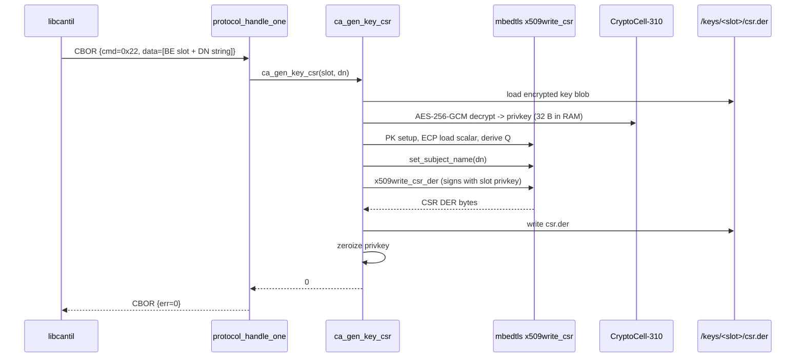

# Task 11 — GEN_KEY_CSR + GET_KEY_CSR

**Status:** Landed 2026-05-28
**Opcodes:** `CMD_GEN_KEY_CSR` (0x22), `CMD_GET_KEY_CSR` (0x23)
**Touches:** [firmware/src/ca/ca.c](../../firmware/src/ca/ca.c), [firmware/src/protocol/protocol.c](../../firmware/src/protocol/protocol.c), [libcantil/src/ca.c](../../libcantil/src/ca.c)

---

## What this task adds

`GEN_KEY_CSR` — for any populated key slot, the device generates a PKCS#10
CSR (subject + pubkey + self-signature with the slot's private key) and
persists it as `/keys/<slot>/csr.der`. Enables external-CA enrolment:
upload the CSR to a parent CA, get back a signed cert, push it via
`PUSH_KEY_CERT` (Task 12).

`GET_KEY_CSR` — retrieve the stored CSR bytes.

Both opcodes use 4-byte BE slot_id; GEN_KEY_CSR additionally takes a
NUL-bounded subject DN string (RFC 4514 form). Responses are empty for
GEN, raw CSR DER for GET.

---

## Implementation

Refactored `load_ca_privkey(...)` → `load_slot_privkey(slot, ...)` —
the same encrypted-blob load path now works for any populated slot.
All existing call sites (slot 0 self-signed cert, SIGN_CSR) updated to
pass `CA_SLOT` explicitly.

`ca_gen_key_csr` mirrors the mbedtls flow used by the test's `gen_csr`
helper:

1. Validate inputs; reject empty DN / out-of-range slot / missing key.
2. `load_slot_privkey(slot, ...)`.
3. mbedtls PK + ECP setup: load scalar `d`, derive `Q = d * G`.
4. `mbedtls_x509write_csr_set_subject_name(dn)` — accepts RFC 4514.
5. `mbedtls_x509write_csr_der` → CSR bytes at end of scratch.
6. `storage_slot_csr_write(slot, ...)`.
7. Zeroize privkey, free contexts.

---

## Sequence

---

## Failure modes & wire mapping

| Condition | `ca_gen_key_csr` | Wire err |
| --- | --- | --- |
| Empty/NULL DN | `-EINVAL` | `ERR_INVALID_ARGS` |
| `slot_id >= MAX_KEY_SLOTS` | `-EINVAL` | `ERR_INVALID_ARGS` |
| No `key.bin` for slot | `-ENOENT` | `ERR_NOT_FOUND` |
| mbedtls DN parse failure | `-EINVAL` | `ERR_INVALID_ARGS` |
| mbedtls CSR sign / DER emit failure | `-EIO` | `ERR_CRYPTO` |
| Storage write failure | `-errno` | `ERR_CRYPTO` |

| Condition | `ca_get_key_csr` | Wire err |
| --- | --- | --- |
| No `csr.der` for slot | `-ENOENT` | `ERR_NOT_FOUND` |
| Storage read failure | `-errno` | `ERR_STORAGE` |

---

## Code map

| File | Role |
| --- | --- |
| [firmware/src/ca/ca.c](../../firmware/src/ca/ca.c) | `ca_gen_key_csr` impl; `load_ca_privkey` generalised to `load_slot_privkey` |
| [firmware/src/protocol/protocol.c](../../firmware/src/protocol/protocol.c) | New `CMD_GEN_KEY_CSR` + `CMD_GET_KEY_CSR` dispatcher cases |
| [libcantil/src/ca.c](../../libcantil/src/ca.c) | `cantil_gen_key_csr`, `cantil_get_key_csr` (caller frees returned buffer) |

---

## Tests (sign_csr — 37/37 PASS)

- `test_34_gen_key_csr_unknown_slot` → `-ENOENT`.
- `test_35_gen_key_csr_invalid_dn` — empty + NULL DN → `-EINVAL`.
- `test_36_gen_key_csr_writes_and_reads_back` — gen + get round-trip;
  parsed CSR's subject contains `CN=enrolment` and `O=Cantil`.
- `test_37_get_key_csr_when_none` — gen slot but no CSR → `-ENOENT`.

## Session log

The interesting refactor: the existing `load_ca_privkey` had its
slot-0 reference hard-coded inside the function. Making it
`load_slot_privkey(slot, ...)` was a 3-line change but had two existing
call sites that needed updating (SIGN_CSR and the self-signed cert
builder both passed CA_SLOT). Caught by grep before the build.

Also tripped on `DN_MAX` being a `ca.c`-internal macro — the dispatcher
needed its own local buffer size, so I just inlined `256`.

Build: FLASH 216176 B / 972 KB (21.72%, +1376 B).
