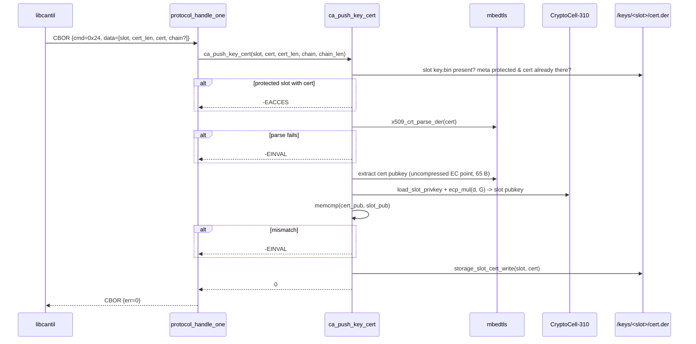

# Task 12 — PUSH_KEY_CERT

**Status:** Landed 2026-05-28
**Opcode:** `CMD_PUSH_KEY_CERT` (0x24)
**Touches:** [firmware/src/ca/ca.c](../../firmware/src/ca/ca.c), [firmware/src/protocol/protocol.c](../../firmware/src/protocol/protocol.c), [libcantil/src/ca.c](../../libcantil/src/ca.c)

---

## What this task adds

Install an externally-signed certificate into a key slot, overriding any
auto-generated self-signed cert. Closes the external-CA enrolment loop:
`GEN_KEY` → `GEN_KEY_CSR` → off-device sign → `PUSH_KEY_CERT`.

**Request layout:**

```text
[0-3]   slot_id (BE u32)
[4-5]   cert_len (BE u16)
[6..]   cert DER bytes
[6+cert_len..]  chain DER bytes (optional)
```

**Response:** empty.

---

## Security: proof-of-possession via pubkey match

The big guard added here: before writing the cert to flash, the device
**re-derives the slot's pubkey** from its (decrypted) private scalar and
compares it byte-for-byte against the cert's `SubjectPublicKeyInfo`. If
they don't match, the cert belongs to a *different* private key and the
push is rejected with `-EINVAL`.

This blocks a class of attack where a compromised client signs a CSR for
key Y under the device's CA, then tries to install that cert in slot X
(which holds key X). The pubkey mismatch is detected before
`storage_slot_cert_write` runs.

`derive_slot_pubkey(slot, pub[65])` is the helper added for this — also
useful later for `LIST_KEYS.pub_key` population and other introspection.

---

## Sequence



Chain handling is currently `ARG_UNUSED` — accepted on the wire and
stored alongside in a future revision; the cert itself overrides the
slot's self-signed by virtue of writing `cert.der`.

---

## Failure modes

| Condition | `ca_push_key_cert` | Wire err |
| --- | --- | --- |
| `cert == NULL` / `cert_len == 0` | `-EINVAL` | `ERR_INVALID_ARGS` |
| `slot_id >= MAX_KEY_SLOTS` | `-EINVAL` | `ERR_INVALID_ARGS` |
| No `key.bin` for slot | `-ENOENT` | `ERR_NOT_FOUND` |
| Slot protected AND cert already present | `-EACCES` | `ERR_DEVICE_LOCKED` |
| Cert DER parse fails | `-EINVAL` | `ERR_INVALID_ARGS` |
| Cert pubkey ≠ slot pubkey | `-EINVAL` | `ERR_INVALID_ARGS` |
| Storage write fails | `-errno` | `ERR_CRYPTO` |

---

## Code map

| File | Role |
| --- | --- |
| [firmware/src/ca/ca.c](../../firmware/src/ca/ca.c) | `ca_push_key_cert` impl; new `derive_slot_pubkey(slot, pub[65])` helper |
| [firmware/src/protocol/protocol.c](../../firmware/src/protocol/protocol.c) | New `CMD_PUSH_KEY_CERT` dispatcher case |
| [libcantil/src/ca.c](../../libcantil/src/ca.c) | `cantil_push_key_cert(s, slot, cert, cert_len, chain, chain_len)` |

---

## Tests (sign_csr — 42/42 PASS)

- `test_38_push_key_cert_unknown_slot` → `-ENOENT`.
- `test_39_push_key_cert_invalid_der` → `-EINVAL`.
- `test_40_push_key_cert_wrong_key_rejected` — sign external keypair's
  CSR under the CA, then try to install that cert into a freshly-genned
  slot → `-EINVAL` (pubkey mismatch caught).
- `test_41_push_key_cert_matches_and_installs` — end-to-end roundtrip:
  gen slot, GEN_KEY_CSR, CA SIGN_CSR, PUSH_KEY_CERT → stored bytes
  match.
- `test_42_push_key_cert_protected_blocked` — first push succeeds, then
  manually set protected, second push → `-EACCES`.

## Session log

The pubkey-match check came up naturally while writing the test
matrix — once I had `derive_slot_pubkey` for use in the verification
test, it was an obvious enhancement to use the same routine to guard
the production path. Now PUSH_KEY_CERT is strictly proof-of-possession
gated.

Build: FLASH 217244 B / 972 KB (21.83%, +1068 B).

libcantil's `cantil_push_key_cert` caps the combined cert+chain payload
at ~2 KB to fit the static request scratch in `cantil_do_request`. Real
P-256 entity certs are ~350 B and chains rarely exceed 1.5 KB, so this
isn't a meaningful constraint for normal use.
