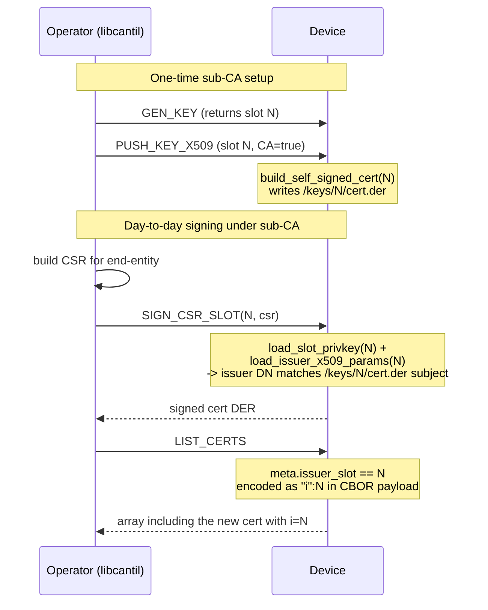

# Task 13 — SIGN_CSR_SLOT (new opcode)

**Status:** Landed 2026-05-28
**Opcode:** `CMD_SIGN_CSR_SLOT` (**new** — 0x2A)
**Touches:** [firmware/src/ca/ca.c](../../firmware/src/ca/ca.c), [firmware/src/protocol/protocol.{h,c}](../../firmware/src/protocol/), [libcantil/](../../libcantil/)

---

## What this task adds

Generic per-slot CSR signing. Up to now `SIGN_CSR` (0x01) was hard-coded
to slot 0. `SIGN_CSR_SLOT` parameterises the issuer so any populated
slot with stored x509 params can sign a CSR — enables hierarchical CAs
(master CA at slot 0 → sub-CA at slot N → end-entity certs).

**Request layout:** `BE u32 issuer_slot ‖ CSR DER`.
**Response:** signed cert DER.

`SIGN_CSR` (0x01) is preserved as a thin wrapper that calls
`ca_sign_csr_slot(CA_SLOT, …)`.

---

## Refactors

Two existing helpers were lightly generalised:

| Before | After |
| --- | --- |
| `load_ca_x509_params(p)` (slot 0 only) | `load_issuer_x509_params(slot, p)` |
| `build_self_signed_cert(slot, p)` — refused any slot != 0 with `-ENOSYS` | now accepts any in-range slot; uses `load_slot_privkey(slot, …)` and writes `cert.der` under that slot |

The `build_self_signed_cert` change unlocks a second flow: a sub-CA
slot, once given x509 params via `PUSH_KEY_X509`, gets its own
self-signed cert. The sub-CA can then sign children via
`SIGN_CSR_SLOT`.

The issued-cert meta also picks up the right issuer: was hard-coded
`CA_SLOT`, now records the actual `issuer_slot`. `LIST_CERTS` (Task 4)
already surfaces this in the CBOR payload's `i` key, so the client can
filter by issuer.

---

## Sub-CA flow end-to-end

---

## Failure modes

| Condition | `ca_sign_csr_slot` | Wire err |
| --- | --- | --- |
| `issuer_slot >= MAX_KEY_SLOTS` | `-EINVAL` | `ERR_INVALID_ARGS` |
| Issuer slot has no `key.bin` | `-ENOENT` | `ERR_NOT_FOUND` |
| Slot 0 issuer but CA not ready (`ca_ready() == false`) | `-ENOENT` | `ERR_NOT_FOUND` |
| Issuer slot has no `x509_data.bin` | `-ENOENT` | `ERR_NOT_FOUND` |
| CSR parse fails | `-EINVAL` | `ERR_INVALID_ARGS` |
| Output buffer too small | `-ENOMEM` | `ERR_CRYPTO` |

---

## Code map

| File | Role |
| --- | --- |
| [firmware/src/protocol/protocol.h](../../firmware/src/protocol/protocol.h) | New `CMD_SIGN_CSR_SLOT = 0x2A` |
| [firmware/src/protocol/protocol.c](../../firmware/src/protocol/protocol.c) | New dispatcher case |
| [firmware/src/ca/ca.{h,c}](../../firmware/src/ca/) | `ca_sign_csr` now wraps `ca_sign_csr_slot(CA_SLOT, …)`. `load_issuer_x509_params(slot, …)`. `build_self_signed_cert` slot-0 guard removed. Issued-cert meta records correct `issuer_slot`. |
| [libcantil/{include/cantil.h, src/ca.c}](../../libcantil/) | `cantil_sign_csr_slot(s, issuer, csr, len, &out, &out_len)` |

---

## Tests (sign_csr — 45/45 PASS)

- `test_43_sign_csr_slot_zero_matches_legacy` — `ca_sign_csr_slot(0, …)`
  yields the same shape as `ca_sign_csr`: parses, has `CN=Cantil CA`
  issuer.
- `test_44_sign_csr_slot_unknown_issuer` — unpopulated slot → `-ENOENT`.
- `test_45_sign_csr_slot_subca_chain` — GEN_KEY + PUSH_KEY_X509 on slot
  1 → sub-CA cert present. Sign end-entity CSR via slot 1.
  `mbedtls_x509_crt_verify(issued, subca)` returns 0. Issued meta
  records `issuer_slot == 1`.

## Session log

First test run failed `test_45` with `-ENOSYS` from
`build_self_signed_cert`. Root cause: when I wrote Task 2 I added
`if (slot != CA_SLOT) return -ENOSYS;` as a deliberate "only slot 0 for
now" guard. Removed it — every storage / load helper it depends on
already takes a `slot` arg. Now `PUSH_KEY_X509` works for any slot,
which is exactly what sub-CA setup needs.

`issuer_slot` in `issued_cert_meta_t` was hard-coded `CA_SLOT` for every
write. Changed to `.issuer_slot = issuer_slot` so the meta reflects
which slot actually signed.

Build: FLASH 217516 B / 972 KB (21.85%, +272 B).
