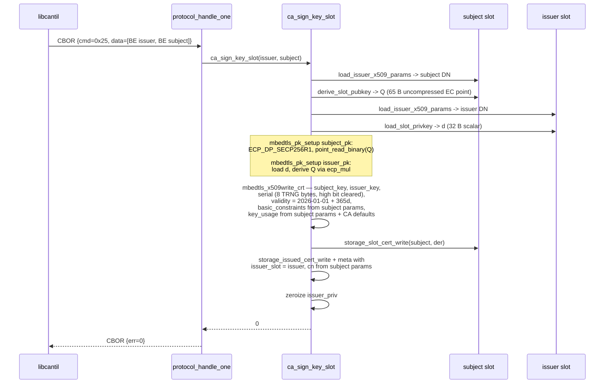

# Task 14 — SIGN_KEY_SLOT

**Status:** Landed 2026-05-28
**Opcode:** `CMD_SIGN_KEY_SLOT` (0x25)
**Touches:** [firmware/src/ca/ca.c](../../firmware/src/ca/ca.c), [firmware/src/protocol/protocol.c](../../firmware/src/protocol/protocol.c), [libcantil/src/ca.c](../../libcantil/src/ca.c)

---

## What this task adds

The last CA opcode. **Issue a certificate without round-tripping a CSR
through the client.** Both the issuer and subject keys live in slots on
the device, so the device can build a cert that:

- subject DN = subject slot's stored x509 params
- subject pubkey = subject slot's pubkey (derived from its private scalar)
- issuer DN = issuer slot's stored x509 params
- signed by = issuer slot's private key

The resulting cert is written to both `/keys/<subject>/cert.der`
(overriding self-signed) and `/certs/<hex>/` (issued cert store, with
meta recording `issuer_slot`).

**Request:** `BE u32 issuer_slot ‖ BE u32 subject_slot`.
**Response:** empty.

---

## When you'd use this

- Provisioning a new slot under an existing CA without a host-side CSR
  step. `GEN_KEY` → `PUSH_KEY_X509` → `SIGN_KEY_SLOT(0, new_slot)` ⇒
  the new slot's existing self-signed cert is replaced by one signed
  by the master CA.
- Re-issuing a cert in place (e.g., after rotating the master CA via
  `PUSH_CA_CERT` — a future task) without re-decoding/encoding CSRs.

`SIGN_CSR_SLOT` is the right call when the subject key is *off-device*
(external enrolment). `SIGN_KEY_SLOT` is the right call when both keys
are on-device.

---

## Sequence

---

## Failure modes

| Condition | `ca_sign_key_slot` | Wire err |
| --- | --- | --- |
| Either slot out of range | `-EINVAL` | `ERR_INVALID_ARGS` |
| Either slot has no `key.bin` | `-ENOENT` | `ERR_NOT_FOUND` |
| Subject slot has no `x509_data.bin` | `-ENOENT` | `ERR_NOT_FOUND` |
| mbedtls cert build failure | `-EIO` | `ERR_CRYPTO` |
| Storage write failure | `-errno` | `ERR_CRYPTO` |

---

## Code map

| File | Role |
| --- | --- |
| [firmware/src/ca/ca.c](../../firmware/src/ca/ca.c) | `ca_sign_key_slot(issuer, subject)`; reuses `derive_slot_pubkey` (Task 12), `load_issuer_x509_params` (Task 13), `load_slot_privkey` |
| [firmware/src/protocol/protocol.c](../../firmware/src/protocol/protocol.c) | New `CMD_SIGN_KEY_SLOT` (0x25) dispatcher case |
| [libcantil/src/ca.c](../../libcantil/src/ca.c) | `cantil_sign_key_slot(s, issuer, subject)` |

---

## Tests (sign_csr — 49/49 PASS)

- `test_46_sign_key_slot_unknown_subject` → `-ENOENT`.
- `test_47_sign_key_slot_unknown_issuer` → `-ENOENT`.
- `test_48_sign_key_slot_subject_no_x509` — gen key but no PUSH_KEY_X509 → `-ENOENT`.
- `test_49_sign_key_slot_chain_verifies` — gen slot 1, PUSH_KEY_X509 for an entity, SIGN_KEY_SLOT(0, 1); slot 1's cert.der parses, `mbedtls_x509_crt_verify(issued, ca)` returns 0, subject DN contains `CN=entity-key`, issuer DN contains `CN=Cantil CA`.

## Session log

Built on shoulders of every preceding task. `derive_slot_pubkey` (Task 12),
`load_issuer_x509_params` + the slot-0-guard removal in
`build_self_signed_cert` (Task 13), `load_slot_privkey` (Task 11) — all
re-used as-is. The mbedtls dance is two `pk_setup`s instead of one
(subject has only Q from `ecp_point_read_binary`; issuer has d and
derives Q via `ecp_mul`).

Issued-cert meta now records cn from subject params instead of from the
CSR subject (no CSR here).

Build: FLASH 218492 B / 972 KB (21.95%, +976 B).

## Across the run

| Suite | Tests | Status |
| --- | --- | --- |
| `ca_bootstrap` | 6 | PASS |
| `protocol_cbor` | 13 | PASS |
| `sign_csr` | 49 | PASS |
| **Total** | **68** | **PASS** |

Final ca_bootstrap CMake needed `common/cbor/cantil_cbor.c` added —
`ca.c` started including `cantil_cbor.h` at Task 4 for LIST_CERTS, and
the bootstrap test had been re-using the old build cache. Caught on the
final regression sweep.
