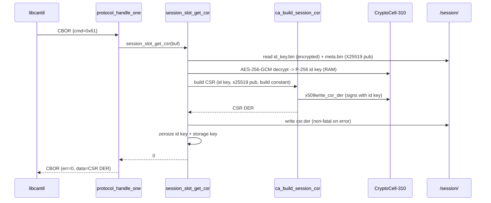

# Task T-05 — GET_SESSION_CERT + GET_SESSION_CSR

**Status:** Landed 2026-05-31, hardware-verified on a real XIAO (session 052)
**Opcodes:** `CMD_GET_SESSION_CERT` (0x60), `CMD_GET_SESSION_CSR` (0x61)
**Touches:** [firmware/src/session/session_slot.c](../../firmware/src/session/session_slot.c), [firmware/src/ca/ca.c](../../firmware/src/ca/ca.c), [firmware/src/protocol/protocol.c](../../firmware/src/protocol/protocol.c), [firmware/src/storage/storage.c](../../firmware/src/storage/storage.c), [libcantil/src/ca.c](../../libcantil/src/ca.c)

This is the first task of **Phase B** of the transport + pairing work
([docs/transport-and-pairing.md](../transport-and-pairing.md)). It exposes the
device's session (transport identity) slot for reading and external-CA
enrolment. The mutating session-slot opcodes — `SIGN_SESSION_FROM_SLOT` (T-06,
0x62) and `PUSH_SESSION_CERT` (T-07, 0x63) — build on this.

---

## What this task adds

`GET_SESSION_CERT` — returns the stored `/session/cert.der` (the P-256 identity
cert that carries the Noise X25519 static key in a private-OID extension).
Useful for out-of-band Tier-2 fingerprint pinning at first contact.

`GET_SESSION_CSR` — generates a PKCS#10 CSR for the session identity and returns
it (also persisted to `/session/csr.der`). Enables enrolling the device's
transport key under an external CA: upload the CSR, get back a signed cert, push
it via `PUSH_SESSION_CERT` (T-07).

Both opcodes take no request body; responses are raw cert / CSR DER.

The session slot is **never** addressable through the `/keys/<n>/` opcodes, so
these are dedicated entry points in the reserved `0x60–0x6F` range.

---

## Implementation

`ca_build_session_csr(x509_blob, blob_len, cn_override, id_priv[32],
x25519_pub[32], out, out_len)` is a direct sibling of `ca_build_session_cert`
(T-02) — same inputs, same `slot_pk_*` / `build_dn` / `rng_cb` reuse, so the
CSR's subject DN is byte-identical to the cert's:

1. Parse the packed x509 blob; reject `is_ca` (a transport identity is never a
   CA); apply the optional CN override.
2. `slot_pk_load_priv(id_priv)` — the P-256 identity scalar becomes the CSR's
   SubjectPublicKeyInfo and signs the request.
3. `build_dn(&p)` → `mbedtls_x509write_csr_set_subject_name`.
4. `mbedtls_x509write_csr_set_key_usage(p.key_usage & 0xFF)` (digitalSignature +
   keyAgreement, both fit a byte).
5. `mbedtls_x509write_csr_set_extension(OID_SESSION_X25519, …, x25519_pub, 32)`
   — the Noise key rides in a **non-critical extensionRequest** so an upstream
   CA can copy it into the issued cert, matching the self-signed cert's binding
   extension. (NCS v3.0.2 mbedtls' CSR `set_extension` has the `critical`
   parameter.)
6. `mbedtls_x509write_csr_der` → CSR bytes at the end of scratch.

`session_slot_get_csr(der, len)` owns the session identity and wires the builder
to storage: returns `-ENOENT` before first-boot init; decrypts
`/session/id_key.bin` (`storage_session_id_key_read` +
`crypto_storage_key_derive` + `crypto_decrypt_blob`), reads the X25519 pubkey
from `meta.bin`, derives the FICR `Cantil-<hex16>` CN, calls
`ca_build_session_csr` with the build constant, and persists to
`/session/csr.der` (a persist failure is non-fatal — the CSR is already in the
caller's buffer). The id-key scalar and storage key are zeroized on exit.

`GET_SESSION_CERT` reuses the existing `session_slot_get_cert` reader.

---

## Sequence (GET_SESSION_CSR)

---

## Failure modes & wire mapping

| Condition | `session_slot_get_csr` | Wire err |
| --- | --- | --- |
| No session identity yet (pre first-boot) | `-ENOENT` | `ERR_NOT_FOUND` |
| Malformed build constant / `is_ca` set | `-EINVAL` | `ERR_INVALID_ARGS` |
| CSR exceeds response buffer | `-ENOMEM` | `ERR_STORAGE` |
| Decrypt / mbedtls sign / DER emit failure | `-EIO` (or other) | `ERR_CRYPTO` |

`GET_SESSION_CERT`: `-ENOENT` → `ERR_NOT_FOUND`, any other error → `ERR_STORAGE`.

Both opcodes flow through the dispatcher's normal `LOCKED`-state gate and the
T-03 recovery allowlist — they are **not** in that allowlist, so a device in
identity-recovery mode refuses them (`ERR_IDENTITY_MISMATCH`), consistent with
the other CA reads.

---

## Code map

| File | Role |
| --- | --- |
| [firmware/src/session/session_slot.c](../../firmware/src/session/session_slot.c) | `session_slot_get_csr` — id-key decrypt, CN derive, persist |
| [firmware/src/ca/ca.c](../../firmware/src/ca/ca.c) | `ca_build_session_csr` — PKCS#10 builder with X25519 extensionRequest |
| [firmware/src/protocol/protocol.c](../../firmware/src/protocol/protocol.c) | `CMD_GET_SESSION_CERT` / `CMD_GET_SESSION_CSR` dispatcher cases |
| [firmware/src/storage/storage.c](../../firmware/src/storage/storage.c) | `storage_session_csr_{write,read}` (`/session/csr.der`) |
| [libcantil/src/ca.c](../../libcantil/src/ca.c) | `cantil_get_session_cert`, `cantil_get_session_csr` (caller frees returned buffer) |

---

## Tests (session_slot — 12/12 PASS on native_sim)

- `test_10_get_csr_before_init_is_enoent` — CSR before first-boot init → `-ENOENT`.
- `test_11_csr_parses_and_matches_cert_identity` — generated CSR parses; its
  subject DN and SubjectPublicKeyInfo match the session cert
  (`same_pubkey` via `mbedtls_pk_write_pubkey_der`); `/session/csr.der` persisted.
- `test_12_csr_carries_x25519_extension` — the X25519 OID + `04 20 || 32 raw`
  payload is present in the CSR DER and matches the cached Noise pubkey.

Needed `CONFIG_MBEDTLS_X509_CSR_PARSE_C=y` in the test `prj.conf` (the writer was
already enabled).

Builds: FREE **226,344 B** FLASH / ~80 KB RAM (+~1 KB FLASH; RAM +4 KB from the
stack bump below); ACCELERATED links clean; libcantil + CLI clean.

---

## Hardware verification (session 052, real XIAO unit #1)

Two CLI subcommands were added to drive the smoke test — `cantil session-cert
<port>` and `cantil session-csr <port>` — each printing the DER as plain hex so
it pipes into openssl. Both opcodes require `UNLOCKED` (per design), so the unit
was unlocked via its button before the fetch.

- `session-cert` → 534-byte self-signed cert; `openssl x509` shows
  `CN=Cantil-69A3031F0204C8EE` (FICR-derived), KU = Digital Signature + Key
  Agreement, the `1.3.6.1.4.1.58270.1.1` X25519 binding extension, ecdsa-with-SHA256.
- `session-csr` → 379-byte CSR; `openssl req -verify` → *self-signature verify
  OK* (proof-of-possession), subject DN identical to the cert, KU + the X25519
  binding present as **extensionRequests**, and the CSR's SPKI sha256 equals the
  cert's SPKI — i.e. the CSR is for the exact session identity key.
- Device stayed healthy across the run (`status` → UNLOCKED, device key
  unchanged).

### Bug found + fixed on hardware: dispatcher stack overflow

The **first** `GET_SESSION_CSR` hard-faulted the device (USB stayed enumerated
but the Noise handshake stopped responding, and even the 1200 bps DFU-touch
didn't fire — a wedged main thread). Root cause: `GET_SESSION_CERT` only *reads*
`/session/cert.der` from flash, but `GET_SESSION_CSR` **builds** the CSR live in
the dispatcher call chain. `ca_build_session_csr` had a local
`der[CERT_DER_MAX]` (2 KB) for the mbedtls write-at-end scratch, stacked on top
of the dispatcher's `resp_data[MSG_BUF_SIZE-2]` (~4 KB) — and then mbedtls ECDSA
signing on top of that. Under `CONFIG_MAIN_STACK_SIZE=8192` it overflowed.

Fix (two parts):

1. **Write the CSR straight into the caller's output buffer** — that buffer is
   already the 4 KB dispatcher scratch, far bigger than any P-256 CSR, so the
   2 KB local was pure waste. mbedtls writes the DER at the *end* of the buffer;
   shift it to the front with `memmove`. Removes ~2 KB from the stack.
2. **Bump `CONFIG_MAIN_STACK_SIZE` 8192 → 12288** for headroom, since the
   sibling CSR/cert-signing opcodes (`GEN_KEY_CSR`, `SIGN_CSR*`) build certs in
   the same dispatcher chain and had the same latent risk — they were only ever
   exercised on native_sim (generous host stack), never on the 8 KB device main
   thread. RAM is abundant (~80 KB / 256 KB used), so 4 KB is cheap insurance.

Lesson for future opcodes: anything that builds a cert/CSR in the dispatcher
runs *under* `resp_data`, so keep large scratch buffers off the stack (write
into the response buffer) and budget the main stack for mbedtls signing.
