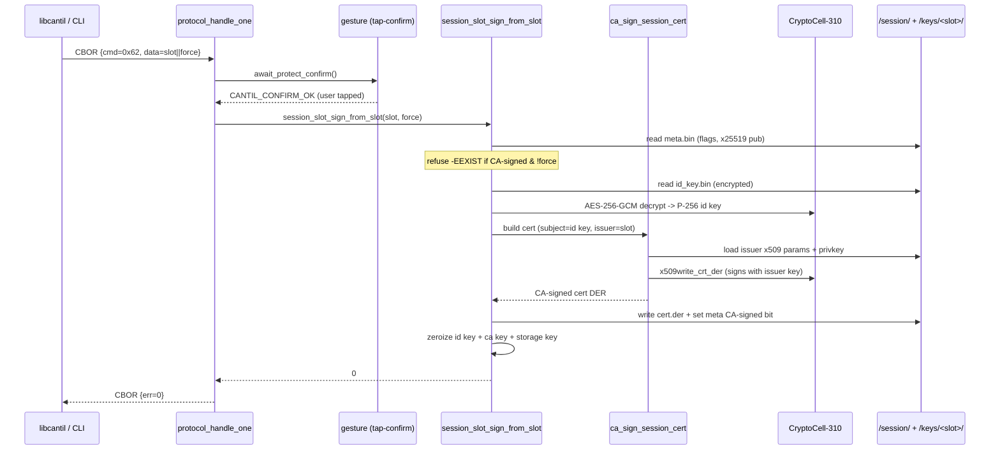

# Task T-06 — SIGN_SESSION_FROM_SLOT

**Status:** Landed 2026-05-31, native_sim + hardware-verified on a real XIAO (session 054)
**Opcode:** `CMD_SIGN_SESSION_FROM_SLOT` (0x62)
**Touches:** [firmware/src/ca/ca.c](../../firmware/src/ca/ca.c), [firmware/src/session/session_slot.c](../../firmware/src/session/session_slot.c), [firmware/src/protocol/protocol.c](../../firmware/src/protocol/protocol.c), [libcantil/src/ca.c](../../libcantil/src/ca.c), [libcantil/cli/main.c](../../libcantil/cli/main.c)

The second task of **Phase B** ([docs/transport-and-pairing.md](../transport-and-pairing.md)),
and the first *mutating* session-slot opcode. It re-signs the device's session
(transport identity) cert with an on-device CA slot, so a client at trust
**Tier 3** (CA allowlist) can validate the device against a CA it already
trusts instead of having to pin a self-signed leaf.

---

## What this task adds

`SIGN_SESSION_FROM_SLOT` — CA-signs `/session/cert.der` using a numbered
`/keys/<n>/` CA slot. The subject identity is **unchanged** (same DN, same
P-256 identity key, same Noise X25519 binding extension); only the issuer DN and
signature change from self → the CA slot.

Request body: **BE u32 `issuer_slot` + 1-byte `force`**. No response body.

**Authorization:** `UNLOCKED` + a **tap-confirm** gesture (the session cert is
the device's identity to the world — changes are never silent). Reuses the
`await_protect_confirm` semaphore path from `PROTECT_SLOT`.

**Re-signing rule (the slice of T-08 that this opcode owns):** self-signed →
CA-signed is allowed freely; an **already-CA-signed** cert refuses re-sign with
`-EEXIST` unless `force=1`. The marker is `meta.flags` bit0
(`SESSION_META_FLAG_CA_SIGNED`), latched on success.

The session slot may **never** be an issuer — it is not a numbered `/keys/`
slot, and `issuer_slot` is range-checked (`< CONFIG_CANTIL_MAX_KEY_SLOTS`). The
full refuse-as-issuer sweep across all opcodes is T-09.

---

## Implementation

`ca_sign_session_cert(issuer_slot, x509_blob, blob_len, cn_override,
id_priv[32], x25519_pub[32], out, out_len)` is a deliberate merge of the two
existing builders:

- **Subject side** = `ca_build_session_cert` (T-02): parse the packed x509 blob,
  reject `is_ca`, apply the FICR CN override, `slot_pk_load_priv(id_priv)` →
  subject key, `build_dn` → subject DN, KU straight from the build constant,
  basic constraints `cA=FALSE`, and the `OID_SESSION_X25519` binding extension
  carrying the raw 32-byte Noise pubkey.
- **Issuer side** = `ca_sign_csr_slot` (T-2A): `load_issuer_x509_params(issuer_slot)`
  + `build_dn` → issuer DN; `load_slot_privkey(issuer_slot)` +
  `slot_pk_load_priv` → issuer key; bounds + `ca_ready()` guard for slot 0.

The CA private key is zeroized on exit. The function does **not** write to
`/certs/` (the session cert is the device's own identity, not an issued
end-entity cert in the store).

`session_slot_sign_from_slot(issuer_slot, force)` owns the identity and wires
the builder to storage:

1. `-ENOENT` before first-boot init.
2. Read `meta.bin`; if `SESSION_META_FLAG_CA_SIGNED` is set and `!force`, return
   `-EEXIST`.
3. Decrypt `/session/id_key.bin` (`storage_session_id_key_read` +
   `crypto_storage_key_derive` + `crypto_decrypt_blob`); read the X25519 pubkey
   from `meta.x25519_pub`; derive the FICR `Cantil-<hex16>` CN.
4. `ca_sign_session_cert(issuer_slot, build_constant, cn, id_priv, x25519_pub,
   cert, &len)`.
5. `storage_session_cert_write` (overwrites cert.der).
6. Set `meta.flags |= SESSION_META_FLAG_CA_SIGNED`, `storage_session_meta_write`.

id-key scalar and storage key are zeroized on exit.

**Why a CA-signed cert still passes the T-03 boot check:**
`ca_session_cert_matches_constant` compares only the *subject-side* identity
fields (O/OU/C/ST/L + validity + key_usage), deliberately ignoring issuer DN /
signature / serial — exactly the fields that change on CA-signing. So a re-signed
device boots normally; no false identity-recovery.

---

## Sequence

---

## Failure modes & wire mapping

| Condition | `session_slot_sign_from_slot` | Wire err |
| --- | --- | --- |
| Tap-confirm denied / timed out / busy | (not called) | `ERR_BUSY` |
| No session identity yet (pre first-boot) | `-ENOENT` | `ERR_NOT_FOUND` |
| Issuer slot empty / slot 0 not ready | `-ENOENT` | `ERR_NOT_FOUND` |
| Already CA-signed, `force=0` | `-EEXIST` | `ERR_INVALID_ARGS` (force needed) |
| Out-of-range issuer slot / `is_ca` blob | `-EINVAL` | `ERR_INVALID_ARGS` |
| Cert exceeds buffer | `-ENOMEM` | `ERR_STORAGE` |
| Decrypt / mbedtls sign / DER emit failure | `-EIO` (or other) | `ERR_CRYPTO` |

Like the other session-slot opcodes, it is **not** in the T-03 recovery
allowlist, so a device in identity-recovery mode refuses it.

---

## Code map

| File | Role |
| --- | --- |
| [firmware/src/ca/ca.c](../../firmware/src/ca/ca.c) | `ca_sign_session_cert` — subject(session) + issuer(CA slot) cert builder |
| [firmware/src/session/session_slot.c](../../firmware/src/session/session_slot.c) | `session_slot_sign_from_slot` — id-key decrypt, force check, persist, meta flag |
| [firmware/src/protocol/protocol.c](../../firmware/src/protocol/protocol.c) | `CMD_SIGN_SESSION_FROM_SLOT` case — tap-confirm + arg decode + err mapping |
| [libcantil/src/ca.c](../../libcantil/src/ca.c) | `cantil_sign_session_from_slot(s, issuer_slot, force)` |
| [libcantil/cli/main.c](../../libcantil/cli/main.c) | `cantil session-sign <slot> [--force] <port>` |

---

## Tests (session_slot — 16/16 PASS on native_sim)

Tests 13–16 provision CA slot 0 (`bootstrap_slot0`: `ca_init` +
`ca_push_key_x509` with an `is_ca` blob) before signing:

- `test_13_sign_from_slot0_self_to_casigned` — self → CA-signed without force.
  Asserts: subject DN preserved, issuer now `Cantil CA` (≠ subject), subject
  P-256 SPKI preserved (`same_pubkey`), X25519 binding extension preserved, and
  the leaf signature **verifies under the CA cert's public key** (`ca_get_cert`
  → `mbedtls_pk_verify` over the TBS SHA-256).
- `test_14_resign_requires_force` — first CA-sign OK; second without force →
  `-EEXIST`; with force → OK.
- `test_15_casigned_still_matches_constant` — after CA-signing,
  `ca_session_cert_matches_constant` still returns 1 (no false recovery).
- `test_16_bad_issuer_slot_rejected` — unprovisioned slot → `-ENOENT`;
  out-of-range slot → `-EINVAL`.

Builds: FREE **228,260 B** FLASH / ~80 KB RAM; ACCELERATED **292,252 B**; both
link clean. libcantil + CLI clean.

---

## Hardware verification (session 054, real XIAO unit #1) — PASS

Verified end-to-end on XIAO unit #1 (`69A3031F0204C8EE`) over the live Noise
session:

1. **CA slot:** the unit's slot 0 had a *stale* key blob from an older
   storage-key vintage — `load_slot_privkey` failed AES-GCM auth with
   `-EBADMSG (-77)` when `provision-ca` triggered a cert rebuild (the recently
   written session identity decrypts fine; only the old slot-0 key was stale).
   Worked around by `cantil provision-ca --new`: `GEN_KEY` minted a fresh P-256
   key in **slot 1**, then `PUSH_KEY_X509` made it a ready CA (`CN=Cantil CA`).
2. **Before:** `cantil session-cert` → 534 B, self-signed (issuer == subject
   `CN=Cantil-69A3031F0204C8EE`).
3. **Sign:** `cantil session-sign 1` → device LED entered the yellow
   `CONFIRM_PROMPT`; the `6 6 6` (Purple×3) confirm gesture was tapped → green
   `CONFIRMED` blink → re-signed OK.
4. **After:** `cantil session-cert` → 474 B, now **CA-signed**:
   - issuer = `CN=Cantil CA, O=Cantil` (slot 1), ≠ subject;
   - subject DN unchanged (`CN=Cantil-69A3031F0204C8EE, …`);
   - subject SPKI (P-256 key) **byte-identical** before vs after (`openssl
     pkey` diff);
   - `1.3.6.1.4.1.58270.1.1` X25519 binding **preserved**;
   - `CA:FALSE`, KU = Digital Signature + Key Agreement (critical),
     ecdsa-with-SHA256.

### Gotchas hit on hardware (none are T-06 bugs)

- **Factory-default unlock masks `UNLOCKED`.** The unit was on the factory
  default unlock sequence, so unlocking ran the forced sequence-rotation path
  and parked the device in `CHANGE_SEQ_CONFIRM`. That state renders the **same
  rainbow `LED_PATTERN_UNLOCKED`** ([gesture.c](../../firmware/src/gesture/gesture.c))
  and `DEVICE_STATUS` reports it as "UNLOCKED" (the status byte is only
  `state == LOCKED`), but `gesture_request_confirm` requires *strictly*
  `UNLOCKED` and returned `-EBUSY` → the dispatcher answered `ERR_BUSY`, which
  the client maps to the catch-all `CANTIL_ERR_PROTOCOL` ("Unexpected
  response"). Reads (`session-cert`, `provision-ca`) worked because they only
  need "not LOCKED". Fix: complete the change-sequence flow to set a custom
  unlock code → real `UNLOCKED` → confirm succeeds.
- **18-tap confirm is error-prone.** `SEQ_CONFIRM = {6,6,6}` (COUNT_COLOR) is 18
  taps; overshooting a digit past the 6-colour palette marks it invalid and
  denies the whole confirm. The smoke-test build widened
  `CONFIG_CANTIL_CONFIRM_TIMEOUT_SEC` 10→30 (throwaway overlay, **not
  committed**) to give a comfortable window.
- **Client diagnostics are coarse.** `map_proto_err` collapses every device
  `err` except OK/LOCKED to `CANTIL_ERR_PROTOCOL`, so `ERR_BUSY` (tap
  denied/timeout) and `ERR_INVALID_ARGS` (force needed) both surface as
  "Unexpected response". Worth a follow-up to map more codes.

New CLI helper added to drive the test: `cantil provision-ca [--new] <port>`
(push a CA x509 to slot 0, or `--new` to GEN_KEY a fresh slot first).
