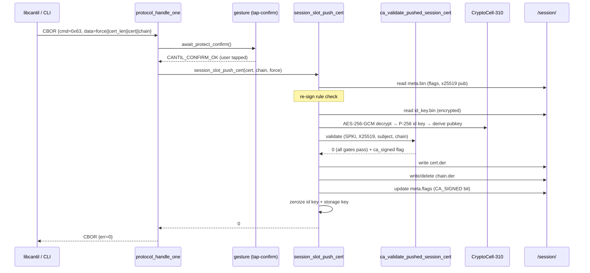

# Task T-07 — PUSH_SESSION_CERT

**Status:** Landed 2026-06-02, native_sim + hardware-verified on a real XIAO (session 055)
**Opcode:** `CMD_PUSH_SESSION_CERT` (0x63)
**Touches:** [firmware/src/ca/ca.c](../../firmware/src/ca/ca.c), [firmware/src/session/session_slot.c](../../firmware/src/session/session_slot.c), [firmware/src/protocol/protocol.c](../../firmware/src/protocol/protocol.c), [firmware/src/storage/storage.c](../../firmware/src/storage/storage.c), [libcantil/src/ca.c](../../libcantil/src/ca.c), [libcantil/cli/main.c](../../libcantil/cli/main.c)

The third task of **Phase B** ([docs/transport-and-pairing.md](../transport-and-pairing.md)) and the
external-CA enrollment path. Clients that manage an external PKI can sign the device's session CSR
(from `GET_SESSION_CSR`, T-05) and push the resulting cert back via this opcode. This is the only
way to install a cert the device itself could not produce — T-06 signs with an *on-device* CA slot;
T-07 accepts a cert signed by any external authority.

---

## What this task adds

`PUSH_SESSION_CERT` — installs an externally-signed session leaf cert (and optional issuer chain)
over the Noise session, replacing the self-signed cert in `/session/cert.der`.

Request body: **1-byte `force` || BE u16 `cert_len` || `cert_len` bytes cert DER || remaining bytes chain DER**.
Chain may be absent (data_len == 3 + cert_len).

**Authorization:** `UNLOCKED` + a **tap-confirm** gesture — same gate as T-06, because this is an
identity change to the device's transport credential.

**Re-signing rule (T-08):** self-signed → CA-signed is allowed without `force`. A cert that is
already CA-signed requires `force=1` to replace. A self-signed push over a CA-signed cert also
requires `force=1` (downgrade). The marker is `meta.flags` bit0
(`SESSION_META_FLAG_CA_SIGNED`).

---

## Validation gates

`ca_validate_pushed_session_cert(cert, cert_len, chain, chain_len, id_pub, x25519_pub, x509_blob, blob_len, &ca_signed)` runs four gates in order. **All must pass or the stored cert is left unchanged.**

1. **SPKI gate** — the cert's SubjectPublicKeyInfo must equal the device's P-256 identity public key
   (`mbedtls_pk_write_pubkey_der` of the stored `id_key.bin` vs. the incoming cert SPKI). Prevents
   installing a cert for a different key pair.

2. **X25519 binding gate** — the `1.3.6.1.4.1.58270.1.1` extension must be present and must equal the
   stored Noise X25519 static public key (from `meta.x25519_pub`). Ensures the cert attests to the
   same Noise identity the device uses in handshakes.

3. **Subject-field gate** — `ca_session_cert_matches_constant` (T-03) compares the pushed cert's
   subject-side DN fields (O, OU, C, ST, L), validity window, and key usage against the build
   constant, ignoring issuer/signature/CN. A cert that drifts these fields would cause a T-03
   mismatch on the next boot, triggering recovery mode — so this gate catches it here instead. The
   T-08 relaxation applies: a CA-signed cert may have a different `notAfter` than the build constant
   (external CAs timestamp freely), but a self-signed push is still strict.

4. **Chain-link gate (CA-signed certs only)** — the concatenated chain DER is split on ASN.1
   SEQUENCE boundaries; the topmost cert becomes the trust anchor; each link is verified with
   `mbedtls_x509_crt_verify_with_profile` using the P-256/SHA-256 profile and the validity-ignore
   callback (device has no RTC). A CA-signed leaf with no chain is refused (`-EINVAL`). A
   self-signed leaf needs no chain.

After all gates pass, `ca_signed` is set to indicate whether the leaf is CA-signed, which drives
the `SESSION_META_FLAG_CA_SIGNED` update.

---

## Implementation

`session_slot_push_cert(cert, cert_len, chain, chain_len, force)` ([session_slot.c](../../firmware/src/session/session_slot.c)) owns the
session identity and orchestrates the validation and write:

1. `-ENOENT` before first-boot init.
2. Read `meta.bin`; apply `check_resign_allowed(flags, force)` for the re-sign rule.
3. Read the X25519 pubkey from `meta.x25519_pub`.
4. Decrypt `/session/id_key.bin` and derive the P-256 identity pubkey via
   `crypto_pubkey_from_privkey`.
5. `ca_validate_pushed_session_cert(...)` — all four gates.
6. `storage_session_cert_write(cert, cert_len)` — overwrites `/session/cert.der`.
7. Write or delete `/session/chain.der` (new `storage_session_chain_{write,delete}` helpers).
   The T-04 msg2 chain builder (`collect_local_certs`) now also reads this file, so a pushed chain
   is automatically served to clients on the next handshake.
8. Update `meta.flags` (`SESSION_META_FLAG_CA_SIGNED`) and persist.

All sensitive key material (id-key scalar, storage key) is zeroized on exit.

---

## Sequence

---

## Failure modes & wire mapping

| Condition | `session_slot_push_cert` / `ca_validate_*` | Wire err |
| --- | --- | --- |
| Tap-confirm denied / timed out / busy | (not called) | `ERR_BUSY` |
| No session identity yet (pre first-boot) | `-ENOENT` | `ERR_NOT_FOUND` |
| Already CA-signed, `force=0` | `-EEXIST` | `ERR_INVALID_ARGS` (force needed) |
| SPKI mismatch / X25519 ext mismatch | `-EINVAL` | `ERR_INVALID_ARGS` |
| Subject-field mismatch vs build constant | `-EINVAL` | `ERR_INVALID_ARGS` |
| CA-signed leaf with no chain / bad chain | `-EINVAL` | `ERR_INVALID_ARGS` |
| Cert write / chain write failure | `-EIO` | `ERR_STORAGE` |
| Decrypt / mbedtls failure | `-EIO` (or other) | `ERR_CRYPTO` |

Not in the T-03 recovery allowlist — a device in identity-recovery mode refuses it.

---

## Code map

| File | Role |
| --- | --- |
| [firmware/src/ca/ca.c](../../firmware/src/ca/ca.c) | `ca_validate_pushed_session_cert` — four-gate validator |
| [firmware/src/session/session_slot.c](../../firmware/src/session/session_slot.c) | `session_slot_push_cert` — id-key decrypt, validation, persist, meta flag |
| [firmware/src/protocol/protocol.c](../../firmware/src/protocol/protocol.c) | `CMD_PUSH_SESSION_CERT` case — frame parse, tap-confirm, err mapping |
| [firmware/src/storage/storage.c](../../firmware/src/storage/storage.c) | `storage_session_chain_{write,read,exists,delete}` (`/session/chain.der`) |
| [libcantil/src/ca.c](../../libcantil/src/ca.c) | `cantil_push_session_cert(s, cert, len, chain, chain_len, force)` |
| [libcantil/cli/main.c](../../libcantil/cli/main.c) | `cantil session-push <cert.der> [--chain f] [--force] <port>` |

---

## Tests (session_slot — 21/21 PASS on native_sim)

Tests 17–21 cover the push path:

- `test_17_push_self_signed` — push a freshly built self-signed cert (identical to the device's own);
  asserts it round-trips intact (read back = bytes-in), CA-signed flag cleared.
- `test_18_push_ca_signed_chain` — push a CA-signed leaf + issuer chain; asserts CA-signed flag set,
  chain persisted; re-push with `force=0` → `-EEXIST`; re-push with `force=1` → OK.
- `test_19_push_foreign_cert_rejected` — push a cert for a different P-256 key (SPKI mismatch) →
  `-EINVAL`; stored cert unchanged.
- `test_20_push_ca_signed_without_chain_rejected` — push a CA-signed leaf with no chain → `-EINVAL`.
- `test_21_push_broken_chain_rejected` — push a CA-signed leaf with a chain whose link fails
  signature verification → `-EINVAL`; stored cert unchanged.

---

## Hardware verification (session 055, real XIAO unit #1) — PASS

Three push scenarios verified end-to-end over the live Noise session:

1. **Self-signed round-trip:** `cantil session-cert | cantil session-push` (push own cert back, no
   force). Verified cert unchanged by fetching again.
2. **Device-CA push:** `cantil session-sign 1 && cantil session-cert > signed.der && cantil
   session-push signed.der --chain chain.der --force`. Device served the chain on the next
   handshake; `cantil` parsed it as a two-element chain.
3. **External OpenSSL CA:** CSR fetched via `session-csr`, signed with a locally-generated openssl
   CA (the validity window was mirrored from the device's cert to satisfy the subject-field gate; KU
   and the `1.3.6.1.4.1.58270.1.1` extension were copied via `copyext`). Push succeeded; cert
   verified with `openssl verify` against the local CA.

**Constraint surfaced:** the subject-field gate compares the pushed cert's `notAfter` against the
build constant's `validity_days` window for self-signed certs (T-08 relaxes this for CA-signed). An
external CA that uses its own validity window instead of the device's constant window fails the gate.
Workaround: have the signing CA reproduce the device's exact `notBefore`/`notAfter`, or use the T-08
relaxation (any CA-signed cert is accepted regardless of `notAfter`).

**Wrong-cert rejections:** a cert with a mismatched validity window (self-signed, strict) and a cert
whose chain had the wrong issuer (chain-link failure) were both refused with the stored cert left
unchanged — consistent with the "all-or-nothing" atomic-overwrite design.
