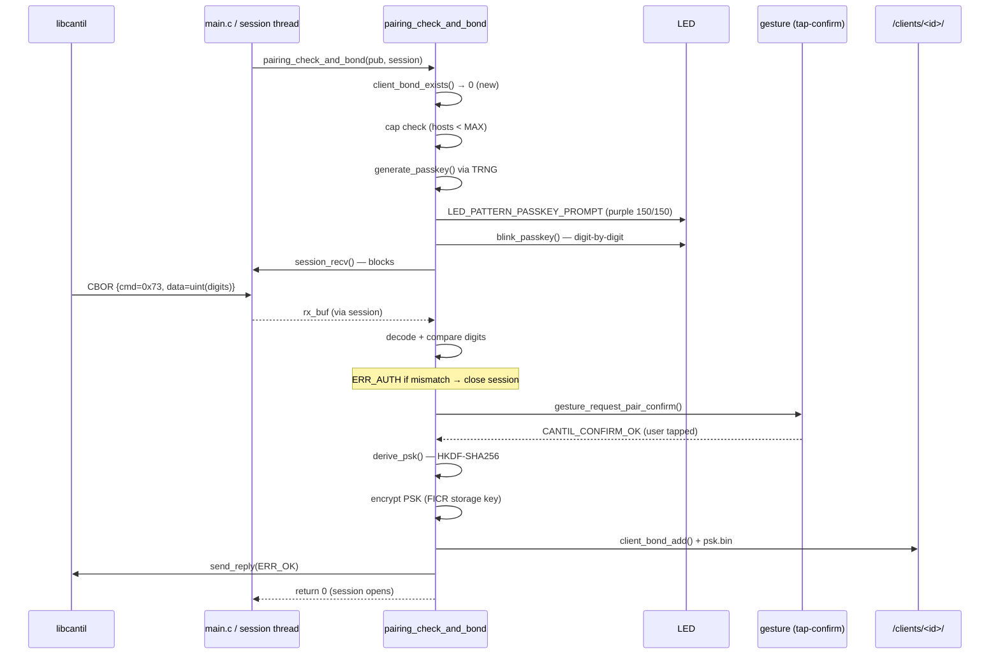

# Task T-18 — PAIRING_PASSKEY_REPLY (and Methods 4/5)

**Status:** T-18 landed 2026-06-04, 6/6 ztests (session 066); T-19 landed 2026-06-05, 5/5 ztests
(session 067); T-20 landed 2026-06-05, 8/8 ztests (session 068)
**Opcode:** `CMD_PAIRING_PASSKEY_REPLY` (0x73) — new opcode; no request reaches the dispatcher
**Touches:** [firmware/src/clients/pairing.c](../../firmware/src/clients/pairing.c), [firmware/src/session/session.c](../../firmware/src/session/session.c), [firmware/src/ca/ca.c](../../firmware/src/ca/ca.c), [libcantil/src/pairing.c](../../libcantil/src/pairing.c), [libcantil/include/cantil.h](../../libcantil/include/cantil.h), [libcantil/cli/main.c](../../libcantil/cli/main.c)

Phase D pairing methods 3 (passkey), 4 (CA-anchored), and 5 (CA-anchored + passkey). These tasks
build on the `/clients/` bond module (T-15) and the pairing gate skeleton (T-16/T-17). Together they
cover the three most security-significant pairing methods.

---

## Context: the pairing gate

`pairing_check_and_bond(pub, session)` is called by `main.c` immediately after a successful
Noise_XX handshake, with the authenticated initiator static pubkey (`pub`). It either returns 0 to
open the session or a negative errno to close it. Which implementation is compiled is determined by
`choice CANTIL_PAIRING_METHOD` in Kconfig.

The Noise handshake guarantees that `pub` is the *real* static key the remote used for the
handshake — the authentication is baked into the Noise math. The pairing gate's job is an
*additional* policy decision: whether *that* authenticated key is *allowed* to open a session
(and, for new keys, whether a bond should be created).

---

## Method 3 — Passkey (T-18)

### What it adds

`PAIRING_PASSKEY` Kconfig choice. For new (unbonded) clients, the device generates a 6-digit TRNG
passkey, blinks it via the LED, waits for the client to reply via `CMD_PAIRING_PASSKEY_REPLY`
(0x73), validates the digits, requests a tap-confirm, then derives a PSK and commits the bond.

### The passkey opcode

`CMD_PAIRING_PASSKEY_REPLY` is **not dispatched via `protocol_handle_one`**. The device is blocked
inside `pairing_check_and_bond` at `session_recv()` when the client sends this frame. The pairing
gate decodes it directly: the expected opcode is 0x73, the payload is a single CBOR `uint` carrying
the 6-digit value. Sending any other opcode while the device is in this state produces a
`ERR_PASSKEY_REQUIRED` response and rejects the session.

Request (client → device): `CBOR {cmd=0x73, seq=N, data=uint(digits)}`
Response (device → client, sent from within the pairing gate): `CBOR {err=0}` on match, `CBOR {err=ERR_AUTH}` on mismatch.

### Passkey generation

```c
static uint32_t generate_passkey(void)
    /* TRNG via crypto_trng(); modulo 1,000,000; retries up to 8×; never returns 0. */
```

Leading zero digits are blinked as 10 white LED flashes (so `000123` is distinguishable from `123`).
The blink is **blocking** — it runs on the session thread before the `session_recv` wait.

### PSK derivation

After the digit exchange and tap-confirm, a 32-byte PSK is derived:

```
IKM  = passkey (4-byte big-endian)
salt = device_pub || client_pub   (64 bytes; device pub from session_get_local_pubkey)
info = "cantil-psk-v1"
PSK  = HKDF-SHA256(IKM, salt, info, 32)
```

The PSK is then encrypted with the FICR storage key (same AES-256-GCM path as all other stored
secrets) and written to `/clients/<id>/psk.bin`.

**Note on PSK enforcement:** the PSK is stored for future use. Per-session PSK enforcement (a
challenge-response or `Noise_XXpsk3` handshake variant) is deferred. Known PSK clients currently
pass the bond-only gate — the stored PSK is not verified on reconnect. This is a documented known
gap; see [docs/open-questions.md](../open-questions.md).

### Sequence



### libcantil side

`cantil_pairing_passkey_reply(session, digits)` sends the 0x73 frame. The CLI flow:

1. `cantil pair [--passkey <digits>]` opens a Noise session, which triggers the pairing gate.
2. If the device is in passkey mode, the LED blinks; the user reads the digits and types them.
3. `pair --passkey <digits>` sends them via `cantil_pairing_passkey_reply`. Without `--passkey`,
   the CLI prompts interactively.

---

## Method 4 — CA-Anchored (T-19)

### What it adds

`PAIRING_CA_ANCHOR` Kconfig choice + `CONFIG_CANTIL_CA_ANCHOR_SLOT` (default 0). No new opcode.
The authentication signal is the client cert chain delivered on **msg3** during the Noise handshake.

### msg3 client cert parsing

`session.c` (responder) now parses the authenticated msg3 CBOR payload `{1:[bstr,…]}` after
decrypting it. The chain is stored in the session struct (parallel to the device chain in the T-04
msg2 path). `session_get_client_cert(session, i, &der, &len)` and
`session_get_client_cert_count(session)` expose it to `pairing_check_and_bond`.

### CA validation

`ca_validate_client_cert_chain(cert_ders[], cert_lens[], count, anchor_slot)` (new in [ca.c](../../firmware/src/ca/ca.c)):

1. Load the trust anchor cert from `anchor_slot`'s stored cert.der via `ca_get_cert`.
2. Parse all client certs via mbedtls; link the intermediates as `leaf.next = ...`.
3. `mbedtls_x509_crt_verify_with_profile` against the anchor, using the existing `chain_vrfy_cb`
   (clears EXPIRED/FUTURE flags — device has no RTC, same policy as T-07/T-12). Passes if any CA
   produces `rc==0 && flags==0`.

Method 4 has **no bond storage**: a client with a valid CA-signed cert is accepted immediately
without creating a `/clients/<id>/` entry. The cert chain in the session struct is the authorization
token; sessions are stateless from the device's storage perspective.

### libcantil side

`cantil_session_open` gains a `const cantil_client_cert_t *client_cert` parameter. Non-NULL causes
the client to encode `{1:[leaf,…]}` on msg3; NULL sends `{}`. `cantil_client_cert_t` holds a DER
pointer + length for the leaf and optionally the chain. The CLI `cantil pair --client-cert <f>
[--client-chain <f>]` saves the cert to the key store; all subsequent commands auto-load it.

---

## Method 5 — CA-Anchored + Passkey (T-20)

`PAIRING_CA_ANCHOR_PLUS_PASSKEY` Kconfig choice. Combines Methods 4 and 3 in sequence:

1. **Known client** (from a previous Method 5 pairing) → pass immediately (no re-validation).
2. **CA cert chain validation** (Method 4 gate) → reject if missing or invalid.
3. **Cap check** — reject before the passkey prompt if no room.
4. **Passkey exchange + tap-confirm + PSK bond** (Method 3 gate).

This method defends against a compromised CA minting a rogue client cert: even with a valid cert
chain, the client must also know the passkey blinked at the device during their first-contact
pairing. The PSK stored after that first contact is available for future per-session enforcement
(same deferred gap as Method 3).

The shared passkey helpers (`generate_passkey`, `blink_passkey`, `derive_psk`, `send_reply`,
`passkey_exchange_and_bond`) are compiled once under `#if PAIRING_PASSKEY ||
PAIRING_CA_ANCHOR_PLUS_PASSKEY` to avoid duplication.

---

## Kconfig structure ([firmware/Kconfig](../../firmware/Kconfig))

```kconfig
choice CANTIL_PAIRING_METHOD
    default PAIRING_TAP_CONFIRM

config PAIRING_PROMISCUOUS    # depends on !CANTIL_SESSION_X509_STRICT — invisible in release
config PAIRING_TOFU
config PAIRING_TAP_CONFIRM    # release default (Method 2)
config PAIRING_PASSKEY        # Method 3
config PAIRING_CA_ANCHOR      # Method 4; enables CONFIG_CANTIL_CA_ANCHOR_SLOT
config PAIRING_CA_ANCHOR_PLUS_PASSKEY  # Method 5; enables both of the above
endchoice
```

`CONFIG_CANTIL_PASSKEY_TIMEOUT_SEC` (default 30) and `CONFIG_CANTIL_PASSKEY_BLINK_PAUSE_MS`
(default 1000) tune the Method 3/5 blink UX.

---

## Failure modes & wire mapping (Method 3)

| Condition | Outcome | Wire result |
| --- | --- | --- |
| Client sends wrong opcode (not 0x73) | `send_reply(ERR_PASSKEY_REQUIRED)` → session closed | `ERR_PASSKEY_REQUIRED` (11) |
| Client sends wrong digit value | `send_reply(ERR_AUTH)` → session closed | `ERR_AUTH` (10) |
| Tap-confirm denied / timed out | `send_reply(ERR_AUTH)` → session closed | `ERR_AUTH` (10) |
| TRNG failure (passkey = 0) | session closed (no reply) | Transport EOF |
| PSK storage failure | Bond committed without PSK (non-fatal for connectivity, logged) | session opens |
| Bond cap full (checked before prompt) | session closed (no reply or `ERR_AUTH`) | `ERR_AUTH` |

---

## Code map

| File | Role |
| --- | --- |
| [firmware/src/clients/pairing.c](../../firmware/src/clients/pairing.c) | All `pairing_check_and_bond` implementations (Methods 0–5); shared passkey helpers |
| [firmware/src/session/session.c](../../firmware/src/session/session.c) | msg3 client cert CBOR parse; `session_get_client_cert*` accessors |
| [firmware/src/ca/ca.c](../../firmware/src/ca/ca.c) | `ca_validate_client_cert_chain` (Methods 4/5) |
| [firmware/src/storage/storage.c](../../firmware/src/storage/storage.c) | `storage_client_bond_psk_{write,read}` (`/clients/<id>/psk.bin`) |
| [libcantil/src/pairing.c](../../libcantil/src/pairing.c) | `cantil_pairing_passkey_reply` |
| [libcantil/src/session.c](../../libcantil/src/session.c) | msg3 client cert CBOR encoding; `cantil_client_cert_t` param |
| [libcantil/include/cantil.h](../../libcantil/include/cantil.h) | `cantil_client_cert_t`; `cantil_pairing_passkey_reply`; `CANTIL_ERR_AUTH`/`CANTIL_ERR_PASSKEY_REQUIRED` |
| [libcantil/cli/main.c](../../libcantil/cli/main.c) | `cantil pair --passkey` / `--client-cert` / `--client-chain` |

---

## Tests

### T-18 — pairing_passkey (6/6 PASS on native_sim)

- `test_passkey_correct` — correct digit reply → bond created + PSK stored.
- `test_passkey_wrong_digits` → `ERR_AUTH`.
- `test_passkey_timeout` — `session_recv` stub returns error → session rejected.
- `test_passkey_gesture_denied` — gesture stub returns DENY → `ERR_AUTH`.
- `test_passkey_cap_full` — fill to cap before entering passkey flow → rejected without prompt.
- `test_known_client_bypasses_passkey` — known bond → pass immediately, no passkey flow.

`pairing_test_passkey_hook(uint32_t pk)` (weak symbol, overridden in tests) intercepts the
generated passkey before the `session_recv` wait, allowing the test stub to prime the reply.

### T-19 — pairing_ca_anchor (5/5 PASS on native_sim)

- `test_valid_cert` — valid chain against anchor slot 0 → accepted.
- `test_no_cert` — empty msg3 payload → rejected.
- `test_wrong_ca` — chain rooted at a different CA → rejected.
- `test_missing_anchor` — anchor slot 0 has no cert → rejected.
- `test_corrupted_der` — malformed cert DER → rejected.

### T-20 — pairing_ca_anchor_passkey (8/8 PASS on native_sim)

- `test_valid_cert_and_passkey` — cert valid + correct passkey + tap-confirm → bonded.
- `test_no_cert` — no client cert → rejected before passkey.
- `test_wrong_ca` — invalid cert chain → rejected before passkey.
- `test_wrong_passkey` → `ERR_AUTH`.
- `test_timeout` — recv timeout → rejected.
- `test_gesture_denied` — tap-confirm denied → `ERR_AUTH`.
- `test_known_client_bypasses_all` — known bond → pass immediately.
- `test_cap_full` — cap full after cert validates → rejected before passkey prompt.
