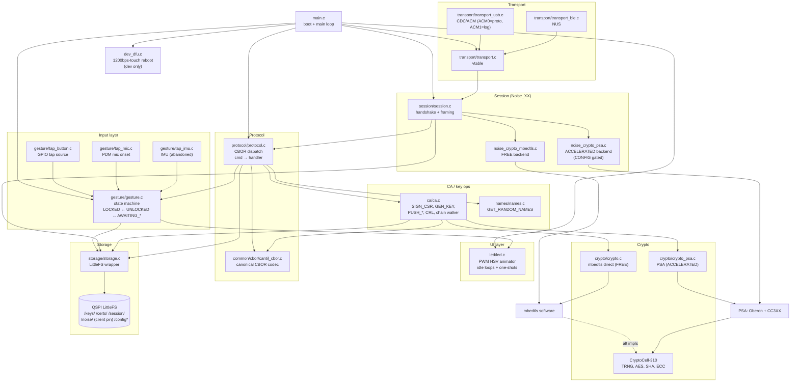

# Firmware Architecture

**Flow:** taps → gesture FSM drives LED + unlock state; USB/BLE → Noise session → CBOR dispatch → CA/storage. Crypto routes through one of two compile-time backends (FREE = mbedtls direct, ACCELERATED = PSA → Oberon/CC3XX).
