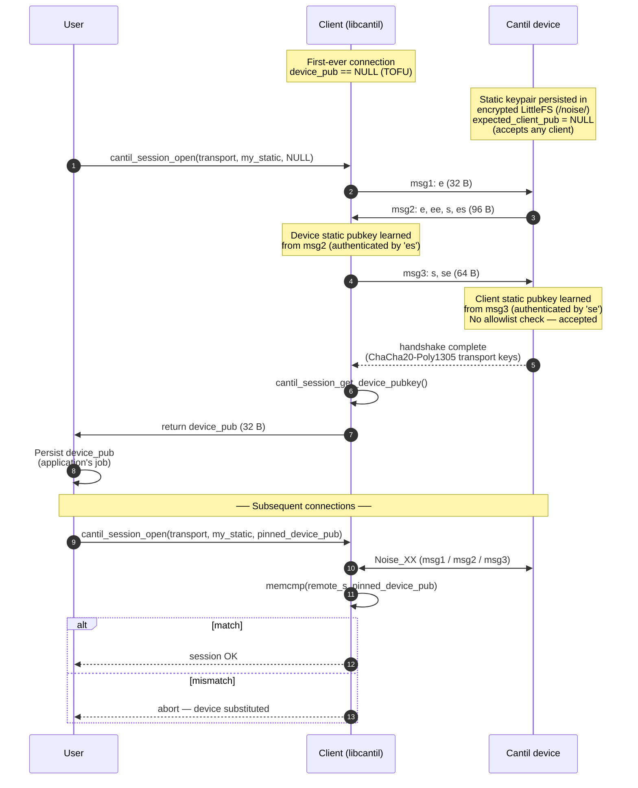

```mermaid
sequenceDiagram
    autonumber
    participant U as User
    participant C as Client (libcantil)
    participant D as Cantil device

    Note over C: First-ever connection<br/>device_pub == NULL (TOFU)
    Note over D: Static keypair persisted in<br/>encrypted LittleFS (/noise/)<br/>expected_client_pub = NULL<br/>(accepts any client)

    U->>C: cantil_session_open(transport, my_static, NULL)
    C->>D: msg1: e            (32 B)
    D->>C: msg2: e, ee, s, es (96 B)

    Note over C: Device static pubkey learned<br/>from msg2 (authenticated by 'es')

    C->>D: msg3: s, se        (64 B)

    Note over D: Client static pubkey learned<br/>from msg3 (authenticated by 'se')<br/>No allowlist check — accepted

    D-->>C: handshake complete<br/>(ChaCha20-Poly1305 transport keys)

    C->>C: cantil_session_get_device_pubkey()
    C->>U: return device_pub (32 B)
    U->>U: Persist device_pub<br/>(application's job)

    Note over U,D: ── Subsequent connections ──

    U->>C: cantil_session_open(transport, my_static, pinned_device_pub)
    C<<->>D: Noise_XX (msg1 / msg2 / msg3)
    C->>C: memcmp(remote_s, pinned_device_pub)
    alt match
        C-->>U: session OK
    else mismatch
        C-->>U: abort — device substituted
    end
```